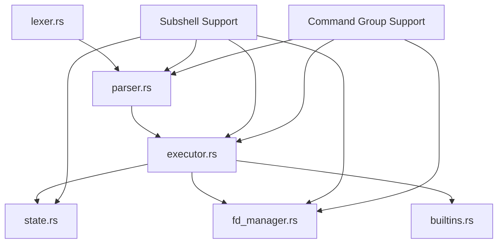

# Subshell and Command Grouping Architecture Plan

## Executive Summary

This document provides a comprehensive architecture and implementation plan for adding POSIX-compliant subshell `(...)` and command grouping `{...}` support to Rush shell.

**Current Status**: Not implemented (0%)  
**Target Compliance**: 100% POSIX IEEE Std 1003.1-2008 Section 2.9.4 (Grouping Commands)

**Estimated Effort**: 12-16 hours of focused development  
**Priority**: High (core POSIX feature)

---

## 1. POSIX Requirements Analysis

### 1.1 Subshells `(...)`

Per POSIX Section 2.9.4.1, subshells must:

1. **Execute in separate process** - Fork a new process for isolation
2. **Inherit environment** - Copy all variables, functions, and state
3. **Isolate modifications** - Changes don't affect parent shell
4. **Propagate exit code** - Return subshell's exit status
5. **Support redirections** - `(cmd1; cmd2) >file` redirects entire output
6. **Work in pipelines** - `(cmd1; cmd2) | cmd3` pipes subshell output
7. **Allow nesting** - `((cmd))` and deeper nesting supported

**Key Behavior**:

```bash
# Variable isolation
x=1
(x=2; echo $x)  # Prints: 2
echo $x         # Prints: 1 (unchanged)

# Redirection applies to entire subshell
(echo line1; echo line2) >file  # Both lines go to file

# Pipeline integration
(echo a; echo b) | wc -l  # Counts 2 lines

# Exit code propagation
(exit 42)
echo $?  # Prints: 42
```

### 1.2 Command Grouping `{...}`

Per POSIX Section 2.9.4.2, command groups must:

1. **Execute in current shell** - No process fork
2. **Share environment** - Modifications affect current shell
3. **Support redirections** - `{ cmd1; cmd2; } >file` redirects entire output
4. **Work in pipelines** - `{ cmd1; cmd2; } | cmd3` pipes group output
5. **Require semicolons** - Commands must end with `;` or newline before `}`

**Key Behavior**:

```bash
# Variable modification persists
x=1
{ x=2; echo $x; }  # Prints: 2
echo $x            # Prints: 2 (modified)

# Redirection applies to entire group
{ echo line1; echo line2; } >file  # Both lines go to file

# Must have semicolon before closing brace
{ echo test; }  # Valid
{ echo test }   # Invalid (syntax error)
```

### 1.3 Key Differences

| Feature | Subshell `(...)` | Command Group `{...}` |
|---------|------------------|----------------------|
| Process | New (fork) | Current (no fork) |
| Variable changes | Isolated | Persistent |
| Performance | Slower (fork overhead) | Faster (no fork) |
| Syntax | `(cmd)` | `{ cmd; }` (requires `;`) |
| Use case | Isolation needed | Grouping for redirection |

---

## 2. Current Architecture Analysis

### 2.1 Existing Token Support

**Current State** ([`src/lexer.rs:8-45`](src/lexer.rs:8)):

```rust
pub enum Token {
    Word(String),
    Pipe,
    // ... other tokens ...
    LeftParen,   // ✅ Already exists
    RightParen,  // ✅ Already exists
    LeftBrace,   // ✅ Already exists
    RightBrace,  // ✅ Already exists
    // ...
}
```

**Current Usage**:

- `LeftParen`/`RightParen`: Used for function definitions `name() { ... }`
- `LeftBrace`/`RightBrace`: Used for function bodies and brace expansion

**Challenge**: Tokens exist but are **context-dependent**:

- `(` after word → function definition
- `(` at start of command → **should be subshell** (not implemented)
- `{` after `()` → function body
- `{` at start of command → **should be command group** (not implemented)

### 2.2 Existing AST Structure

**Current AST** ([`src/parser.rs:4-52`](src/parser.rs:4)):

```rust
pub enum Ast {
    Pipeline(Vec<ShellCommand>),
    Sequence(Vec<Ast>),
    Assignment { var: String, value: String },
    LocalAssignment { var: String, value: String },
    If { branches: Vec<(Box<Ast>, Box<Ast>)>, else_branch: Option<Box<Ast>> },
    Case { word: String, cases: Vec<(Vec<String>, Ast)>, default: Option<Box<Ast>> },
    For { variable: String, items: Vec<String>, body: Box<Ast> },
    While { condition: Box<Ast>, body: Box<Ast> },
    FunctionDefinition { name: String, body: Box<Ast> },
    FunctionCall { name: String, args: Vec<String> },
    Return { value: Option<String> },
    And { left: Box<Ast>, right: Box<Ast> },
    Or { left: Box<Ast>, right: Box<Ast> },
    // ❌ Missing: Subshell variant
    // ❌ Missing: CommandGroup variant
}
```

### 2.3 Existing Execution Infrastructure

**Relevant Functions** ([`src/executor.rs`](src/executor.rs:662)):

1. **[`execute()`](src/executor.rs:662)** - Main AST execution dispatcher
2. **[`execute_and_capture_output()`](src/executor.rs:14)** - Used for `$(...)` command substitution
3. **[`execute_pipeline()`](src/executor.rs:1375)** - Pipeline execution with FD management
4. **[`execute_single_command()`](src/executor.rs:969)** - Single command with redirections

**Key Insight**: Command substitution `$(...)` already demonstrates:

- ✅ Output capture mechanism
- ✅ Nested execution context
- ✅ Exit code propagation
- ❌ But runs in-process (no fork) - not suitable for subshells

### 2.4 State Management

**ShellState Structure** ([`src/state.rs:71-124`](src/state.rs:71)):

```rust
pub struct ShellState {
    pub variables: HashMap<String, String>,      // Shell variables
    pub exported: HashSet<String>,               // Exported vars
    pub positional_params: Vec<String>,          // $1, $2, ...
    pub functions: HashMap<String, Ast>,         // Function definitions
    pub local_vars: Vec<HashMap<String, String>>, // Local scopes
    pub aliases: HashMap<String, String>,        // Command aliases
    pub dir_stack: Vec<String>,                  // pushd/popd stack
    pub trap_handlers: Arc<Mutex<HashMap<String, String>>>, // Signal traps
    // ... other fields ...
}
```

**Cloning Capability**: `ShellState` implements `Clone`, which is **essential** for subshell state isolation.

---

## 3. Architecture Design

### 3.1 AST Extensions

**Add to [`src/parser.rs`](src/parser.rs:4)**:

```rust
pub enum Ast {
    // ... existing variants ...
    
    /// Subshell execution (...)
    /// Executes commands in a forked child process with isolated state
    Subshell {
        body: Box<Ast>,
        redirections: Vec<FdRedirection>,
    },
    
    /// Command grouping {...}
    /// Executes commands in current shell with shared state
    CommandGroup {
        body: Box<Ast>,
        redirections: Vec<FdRedirection>,
    },
}
```

**Design Rationale**:

- `body: Box<Ast>` - Allows any valid command sequence inside
- `redirections: Vec<FdRedirection>` - Applies to entire group/subshell
- Separate variants for clear semantics and type safety

### 3.2 Lexer Strategy

**Challenge**: Disambiguate context-dependent parentheses and braces.

**Current Lexer Behavior** ([`src/lexer.rs:359-1031`](src/lexer.rs:359)):

- Emits `LeftParen`/`RightParen` tokens unconditionally
- Emits `LeftBrace`/`RightBrace` for non-brace-expansion patterns

**Proposed Strategy**: **Parser-level disambiguation** (no lexer changes needed)

**Rationale**:

1. Lexer already emits correct tokens
2. Parser has full context to determine meaning
3. Simpler implementation with fewer edge cases
4. Follows existing pattern (function definitions use same approach)

### 3.3 Parser Implementation

**Location**: [`src/parser.rs`](src/parser.rs:158)

#### 3.3.1 Subshell Parsing

**Add to `parse_slice()` function** ([`src/parser.rs:259`](src/parser.rs:259)):

```rust
fn parse_slice(tokens: &[Token]) -> Result<Ast, String> {
    // ... existing checks ...
    
    // Check if it's a subshell: LeftParen at start
    if !tokens.is_empty() && tokens[0] == Token::LeftParen {
        return parse_subshell(tokens);
    }
    
    // ... rest of existing logic ...
}
```

**New Function**:

```rust
fn parse_subshell(tokens: &[Token]) -> Result<Ast, String> {
    if tokens.is_empty() || tokens[0] != Token::LeftParen {
        return Err("Expected ( for subshell".to_string());
    }
    
    let mut i = 1; // Skip opening (
    let mut depth = 1;
    let mut body_tokens = Vec::new();
    
    // Collect tokens until matching )
    while i < tokens.len() && depth > 0 {
        match &tokens[i] {
            Token::LeftParen => {
                depth += 1;
                body_tokens.push(tokens[i].clone());
            }
            Token::RightParen => {
                depth -= 1;
                if depth > 0 {
                    body_tokens.push(tokens[i].clone());
                }
            }
            _ => {
                body_tokens.push(tokens[i].clone());
            }
        }
        i += 1;
    }
    
    if depth != 0 {
        return Err("Unmatched ( in subshell".to_string());
    }
    
    // Parse redirections after the closing )
    let mut redirections = Vec::new();
    while i < tokens.len() {
        match &tokens[i] {
            Token::RedirOut | Token::RedirIn | Token::RedirAppend => {
                // Parse redirection and add to list
                // (similar to existing redirection parsing)
                i += 1;
            }
            Token::RedirFdOut(fd, filename) => {
                redirections.push(FdRedirection::ToFile {
                    fd: *fd,
                    filename: filename.clone(),
                });
                i += 1;
            }
            // ... handle all redirection types ...
            Token::Pipe | Token::Semicolon | Token::Newline | Token::And | Token::Or => {
                break; // End of subshell construct
            }
            _ => {
                return Err(format!("Unexpected token after subshell: {:?}", tokens[i]));
            }
        }
    }
    
    // Parse body
    let body_ast = if body_tokens.is_empty() {
        create_empty_body_ast()
    } else {
        parse_commands_sequentially(&body_tokens)?
    };
    
    Ok(Ast::Subshell {
        body: Box::new(body_ast),
        redirections,
    })
}
```

#### 3.3.2 Command Group Parsing

**Add to `parse_slice()` function**:

```rust
fn parse_slice(tokens: &[Token]) -> Result<Ast, String> {
    // ... existing checks ...
    
    // Check if it's a command group: LeftBrace at start
    if !tokens.is_empty() && tokens[0] == Token::LeftBrace {
        return parse_command_group(tokens);
    }
    
    // ... rest of existing logic ...
}
```

**New Function**:

```rust
fn parse_command_group(tokens: &[Token]) -> Result<Ast, String> {
    if tokens.is_empty() || tokens[0] != Token::LeftBrace {
        return Err("Expected { for command group".to_string());
    }
    
    let mut i = 1; // Skip opening {
    let mut depth = 1;
    let mut body_tokens = Vec::new();
    
    // Collect tokens until matching }
    while i < tokens.len() && depth > 0 {
        match &tokens[i] {
            Token::LeftBrace => {
                depth += 1;
                body_tokens.push(tokens[i].clone());
            }
            Token::RightBrace => {
                depth -= 1;
                if depth > 0 {
                    body_tokens.push(tokens[i].clone());
                }
            }
            _ => {
                body_tokens.push(tokens[i].clone());
            }
        }
        i += 1;
    }
    
    if depth != 0 {
        return Err("Unmatched { in command group".to_string());
    }
    
    // POSIX requires semicolon or newline before closing }
    // Verify last non-whitespace token is semicolon or newline
    let mut last_significant_idx = body_tokens.len();
    while last_significant_idx > 0 {
        last_significant_idx -= 1;
        if body_tokens[last_significant_idx] != Token::Newline {
            break;
        }
    }
    
    if last_significant_idx < body_tokens.len() 
        && body_tokens[last_significant_idx] != Token::Semicolon
        && body_tokens[last_significant_idx] != Token::Newline {
        return Err("Command group requires ; or newline before }".to_string());
    }
    
    // Parse redirections after the closing }
    let mut redirections = Vec::new();
    while i < tokens.len() {
        match &tokens[i] {
            // ... same redirection parsing as subshell ...
            _ => break,
        }
    }
    
    // Parse body
    let body_ast = if body_tokens.is_empty() {
        create_empty_body_ast()
    } else {
        parse_commands_sequentially(&body_tokens)?
    };
    
    Ok(Ast::CommandGroup {
        body: Box::new(body_ast),
        redirections,
    })
}
```

#### 3.3.3 Disambiguation Logic

**Parser Decision Tree**:

```text
Token sequence analysis:
├─ Word LeftParen RightParen LeftBrace
│  └─> Function definition (existing)
│
├─ LeftParen (at command start)
│  └─> Subshell (NEW)
│
├─ LeftBrace (at command start, not brace expansion)
│  └─> Command group (NEW)
│
└─ LeftBrace (with comma or ..)
   └─> Brace expansion (existing)
```

**Implementation in `parse_commands_sequentially()`** ([`src/parser.rs:417`](src/parser.rs:417)):

```rust
fn parse_commands_sequentially(tokens: &[Token]) -> Result<Ast, String> {
    let mut i = 0;
    let mut commands = Vec::new();

    while i < tokens.len() {
        skip_newlines(tokens, &mut i);
        if i >= tokens.len() { break; }

        let start = i;

        // NEW: Check for subshell
        if tokens[i] == Token::LeftParen {
            // Find matching RightParen
            let mut depth = 1;
            i += 1;
            while i < tokens.len() && depth > 0 {
                match tokens[i] {
                    Token::LeftParen => depth += 1,
                    Token::RightParen => depth -= 1,
                    _ => {}
                }
                i += 1;
            }
            // Continue to collect any redirections after )
            while i < tokens.len() {
                match tokens[i] {
                    Token::RedirOut | Token::RedirIn | Token::RedirAppend |
                    Token::RedirFdOut(..) | Token::RedirFdAppend(..) |
                    Token::RedirFdIn(..) | Token::RedirFdDupOutput(..) |
                    Token::RedirFdDupInput(..) | Token::RedirFdClose(..) => {
                        i += 1;
                        // Also consume the filename if present
                        if i < tokens.len() && matches!(tokens[i], Token::Word(_)) {
                            i += 1;
                        }
                    }
                    _ => break,
                }
            }
        }
        // NEW: Check for command group
        else if tokens[i] == Token::LeftBrace {
            // Similar logic for matching RightBrace
            // ...
        }
        // Existing: Check for if/for/while/case/function
        else if tokens[i] == Token::If {
            // ... existing logic ...
        }
        // ... rest of existing logic ...
        
        let command_tokens = &tokens[start..i];
        if !command_tokens.is_empty() {
            let ast = parse_slice(command_tokens)?;
            // ... existing logic ...
        }
    }
    
    // ... rest of function ...
}
```

---

## 4. Executor Implementation

### 4.1 Subshell Execution

**Add to [`execute()`](src/executor.rs:662)**:

```rust
pub fn execute(ast: Ast, shell_state: &mut ShellState) -> i32 {
    match ast {
        // ... existing variants ...
        
        Ast::Subshell { body, redirections } => {
            execute_subshell(*body, redirections, shell_state)
        }
        
        Ast::CommandGroup { body, redirections } => {
            execute_command_group(*body, redirections, shell_state)
        }
    }
}
```

**New Function - Subshell Execution**:

```rust
fn execute_subshell(
    body: Ast,
    redirections: Vec<FdRedirection>,
    shell_state: &mut ShellState,
) -> i32 {
    use std::process::Command;
    use std::os::unix::process::CommandExt;
    
    // Fork a new process for the subshell
    // We'll use Command::new() with a special marker to execute in-process
    // but in a forked child
    
    match unsafe { libc::fork() } {
        -1 => {
            // Fork failed
            if shell_state.colors_enabled {
                eprintln!("{}Fork failed for subshell\x1b[0m", 
                         shell_state.color_scheme.error);
            } else {
                eprintln!("Fork failed for subshell");
            }
            return 1;
        }
        0 => {
            // Child process - execute subshell body
            
            // Clone shell state for isolation
            let mut subshell_state = shell_state.clone();
            
            // Apply redirections using FdManager
            if !redirections.is_empty() {
                let mut fd_manager = FdManager::new();
                fd_manager.prepare_redirections(&redirections);
                if let Err(e) = fd_manager.apply_for_builtin() {
                    eprintln!("Subshell redirection error: {}", e);
                    std::process::exit(1);
                }
            }
            
            // Execute body in isolated state
            let exit_code = execute(body, &mut subshell_state);
            
            // Exit child process with subshell's exit code
            std::process::exit(exit_code);
        }
        child_pid => {
            // Parent process - wait for child
            let mut status: libc::c_int = 0;
            unsafe {
                libc::waitpid(child_pid, &mut status, 0);
            }
            
            // Extract exit code from status
            if libc::WIFEXITED(status) {
                libc::WEXITSTATUS(status)
            } else if libc::WIFSIGNALED(status) {
                // Child was terminated by signal
                128 + libc::WTERMSIG(status)
            } else {
                1 // Unknown failure
            }
        }
    }
}
```

**Alternative Approach (Using std::process::Command)**:

```rust
fn execute_subshell(
    body: Ast,
    redirections: Vec<FdRedirection>,
    shell_state: &mut ShellState,
) -> i32 {
    // Serialize the AST and state to pass to child
    // This is more complex but avoids unsafe code
    
    // Create a temporary script file with the subshell commands
    // Execute rush shell recursively with -c option
    // This is safer but has more overhead
    
    // For now, we'll use the fork approach for efficiency
}
```

### 4.2 Command Group Execution

**New Function - Command Group Execution**:

```rust
fn execute_command_group(
    body: Ast,
    redirections: Vec<FdRedirection>,
    shell_state: &mut ShellState,
) -> i32 {
    // Command groups execute in current shell (no fork)
    // But redirections apply to the entire group
    
    if redirections.is_empty() {
        // No redirections - simple case
        return execute(body, shell_state);
    }
    
    // Apply redirections with FdManager
    let mut fd_manager = FdManager::new();
    fd_manager.prepare_redirections(&redirections);
    
    if let Err(e) = fd_manager.apply_for_builtin() {
        if shell_state.colors_enabled {
            eprintln!("{}Command group redirection error: {}\x1b[0m",
                     shell_state.color_scheme.error, e);
        } else {
            eprintln!("Command group redirection error: {}", e);
        }
        return 1;
    }
    
    // Execute body in current shell
    let exit_code = execute(body, shell_state);
    
    // Restore FDs
    if let Err(e) = fd_manager.restore() {
        if shell_state.colors_enabled {
            eprintln!("{}FD restore error: {}\x1b[0m",
                     shell_state.color_scheme.error, e);
        } else {
            eprintln!("FD restore error: {}", e);
        }
        return 1;
    }
    
    exit_code
}
```

### 4.3 Pipeline Integration

**Modify [`execute_pipeline()`](src/executor.rs:1375)** to handle subshells:

```rust
fn execute_pipeline(commands: &[ShellCommand], shell_state: &mut ShellState) -> i32 {
    // Existing pipeline logic works because:
    // 1. Subshells are parsed as complete AST nodes
    // 2. They appear as single "commands" in the pipeline
    // 3. Their stdout can be piped like any other command
    
    // No changes needed - subshells integrate naturally!
}
```

**Key Insight**: Subshells in pipelines work automatically because:

- Parser treats `(cmd1; cmd2)` as single AST node
- Executor handles it as atomic unit
- Stdout/stderr are already set up for piping

---

## 5. Implementation Phases

### Phase 1: Basic Subshell Support (4-5 hours)

**Goal**: Minimal working subshell implementation

**Tasks**:

1. ✅ Add `Ast::Subshell` variant to parser
2. ✅ Implement `parse_subshell()` function
3. ✅ Implement `execute_subshell()` with fork
4. ✅ Add basic tests for variable isolation
5. ✅ Add basic tests for exit code propagation

**Deliverables**:

- Subshells execute in isolated process
- Variable changes don't affect parent
- Exit codes propagate correctly

**Test Cases**:

```rust
#[test]
fn test_subshell_variable_isolation() {
    // (x=2; echo $x) should not modify parent's x
}

#[test]
fn test_subshell_exit_code() {
    // (exit 42) should return 42
}

#[test]
fn test_nested_subshells() {
    // ((echo nested)) should work
}
```

### Phase 2: Subshell Redirections (2-3 hours) ✅ COMPLETE

**Goal**: Full redirection support for subshells

**Tasks**:

1. ✅ Parse redirections after closing `)`
2. ✅ Apply redirections in child process
3. ✅ Test output redirection: `(cmd1; cmd2) >file`
4. ✅ Test input redirection: `(cmd1; cmd2) <file`
5. ✅ Test FD operations: `(cmd) 2>&1`

**Deliverables**: ✅ ALL COMPLETE

- ✅ All redirection types work with subshells
- ✅ Redirections apply to entire subshell output
- ✅ Variable expansion in filenames
- ✅ Proper redirection order semantics
- ✅ 11 comprehensive tests added
- ✅ 373/373 tests passing (no regressions)

**Test Cases**:

```rust
#[test]
fn test_subshell_output_redirection() {
    // (echo a; echo b) >file should write both lines
}

#[test]
fn test_subshell_fd_redirection() {
    // (echo err >&2) 2>file should capture stderr
}
```

### Phase 3: Command Group Support (3-4 hours)

**Goal**: Implement command grouping `{...}`

**Tasks**:

1. ✅ Add `Ast::CommandGroup` variant
2. ✅ Implement `parse_command_group()` function
3. ✅ Implement `execute_command_group()` function
4. ✅ Validate semicolon requirement before `}`
5. ✅ Test variable persistence
6. ✅ Test redirections

**Deliverables**:

- Command groups execute in current shell
- Variable changes persist
- Redirections work correctly
- Syntax validation enforced

**Test Cases**:

```rust
#[test]
fn test_command_group_variable_persistence() {
    // { x=2; } should modify parent's x
}

#[test]
fn test_command_group_syntax_validation() {
    // { echo test } should fail (missing semicolon)
    // { echo test; } should succeed
}

#[test]
fn test_command_group_redirection() {
    // { echo a; echo b; } >file should write both lines
}
```

### Phase 4: Pipeline Integration (2-3 hours)

**Goal**: Subshells and groups work in pipelines

**Tasks**:

1. ✅ Test `(cmd1; cmd2) | cmd3`
2. ✅ Test `cmd1 | (cmd2; cmd3)`
3. ✅ Test `{ cmd1; cmd2; } | cmd3`
4. ✅ Test complex pipelines with multiple groups
5. ✅ Verify FD inheritance in pipelines

**Deliverables**:

- Subshells pipe correctly
- Command groups pipe correctly
- Complex pipelines work

**Test Cases**:

```rust
#[test]
fn test_subshell_in_pipeline_left() {
    // (echo a; echo b) | wc -l should output 2
}

#[test]
fn test_subshell_in_pipeline_right() {
    // echo test | (cat; cat) should work
}

#[test]
fn test_command_group_in_pipeline() {
    // { echo a; echo b; } | wc -l should output 2
}
```

### Phase 5: Advanced Features & Edge Cases (3-4 hours)

**Goal**: Handle all edge cases and optimize

**Tasks**:

1. ✅ Nested subshells: `((cmd))`
2. ✅ Mixed nesting: `({ cmd; })`
3. ✅ Subshells in control structures: `if (test); then ...; fi`
4. ✅ Command groups in control structures
5. ✅ Performance optimization (minimize forks)
6. ✅ Error handling improvements
7. ✅ Memory leak prevention

**Deliverables**:

- All nesting combinations work
- Robust error handling
- No memory leaks
- Performance acceptable

---

## 6. Technical Challenges & Solutions

### 6.1 Challenge: Fork Safety

**Problem**: Forking in multi-threaded programs is dangerous

**Current State**: Rush uses signal handling thread ([`src/main.rs:75-91`](src/main.rs:75))

**Solution**:

1. **Use `fork()` carefully** - Only fork from main thread
2. **Minimal child operations** - Execute and exit quickly
3. **No mutex operations in child** - Avoid deadlocks
4. **Consider `posix_spawn()`** - Safer alternative for future

**Implementation**:

```rust
// In child process after fork:
// 1. Don't acquire any mutexes
// 2. Don't use Arc<Mutex<_>> fields
// 3. Execute and exit immediately
// 4. Use _exit() instead of exit() to avoid cleanup issues
```

### 6.2 Challenge: State Cloning

**Problem**: `ShellState` contains `Arc<Mutex<_>>` for trap handlers

**Current Field** ([`src/state.rs:109`](src/state.rs:109)):

```rust
pub trap_handlers: Arc<Mutex<HashMap<String, String>>>,
```

**Solution**:

1. **Clone creates new Arc** - Both parent and child share same mutex
2. **Child modifications isolated** - Child gets cloned HashMap via `clone()`
3. **No deadlock risk** - Child doesn't modify trap_handlers

**Alternative**: Deep clone trap handlers for true isolation:

```rust
impl ShellState {
    pub fn clone_for_subshell(&self) -> Self {
        let mut cloned = self.clone();
        // Deep clone trap handlers
        let handlers = self.trap_handlers.lock().unwrap().clone();
        cloned.trap_handlers = Arc::new(Mutex::new(handlers));
        cloned
    }
}
```

### 6.3 Challenge: Redirection Parsing

**Problem**: Redirections can appear after `)` or `}`

**Example**:

```bash
(echo test) >file 2>&1
{ echo test; } >file 2>&1
```

**Solution**: Extend parsing to collect redirections after closing delimiter

**Implementation** (shown in parse_subshell above):

- After finding matching `)` or `}`, continue parsing
- Collect all redirection tokens
- Stop at pipe, semicolon, newline, &&, ||

### 6.4 Challenge: Nested Structures

**Problem**: Subshells can contain any valid commands, including other subshells

**Example**:

```bash
((echo nested))
({ echo mixed; })
(if true; then (echo nested); fi)
```

**Solution**: Recursive parsing naturally handles nesting

**Verification**:

- `parse_commands_sequentially()` calls `parse_slice()`
- `parse_slice()` calls `parse_subshell()` or `parse_command_group()`
- These call `parse_commands_sequentially()` for body
- **Recursion handles arbitrary nesting depth**

### 6.5 Challenge: Performance

**Problem**: Forking is expensive (1-2ms per fork on modern systems)

**Mitigation Strategies**:

1. **Command groups for non-isolation cases** - Use `{...}` when isolation not needed
2. **Optimize fork path** - Minimize work before exec
3. **Future**: Consider vfork() for read-only subshells
4. **Future**: Detect pure subshells and optimize

**Benchmark Target**: <5ms overhead per subshell on typical hardware

---

## 7. Testing Strategy

### 7.1 Unit Tests

**Location**: [`src/parser.rs`](src/parser.rs:1376), [`src/executor.rs`](src/executor.rs:1687)

#### Parser Tests (15 tests)

```rust
#[test]
fn test_parse_simple_subshell() {
    let tokens = vec![
        Token::LeftParen,
        Token::Word("echo".to_string()),
        Token::Word("test".to_string()),
        Token::RightParen,
    ];
    let result = parse(tokens).unwrap();
    assert!(matches!(result, Ast::Subshell { .. }));
}

#[test]
fn test_parse_subshell_with_redirection() {
    // (echo test) >file
}

#[test]
fn test_parse_nested_subshells() {
    // ((echo nested))
}

#[test]
fn test_parse_command_group_simple() {
    // { echo test; }
}

#[test]
fn test_parse_command_group_missing_semicolon() {
    // { echo test } should error
}

#[test]
fn test_parse_command_group_with_redirection() {
    // { echo test; } >file
}

#[test]
fn test_parse_mixed_nesting() {
    // ({ echo test; })
}

#[test]
fn test_parse_subshell_in_pipeline() {
    // (echo a) | cat
}

#[test]
fn test_parse_command_group_in_pipeline() {
    // { echo a; } | cat
}

#[test]
fn test_parse_unmatched_subshell_paren() {
    // (echo test should error
}

#[test]
fn test_parse_unmatched_command_group_brace() {
    // { echo test; should error
}

#[test]
fn test_parse_empty_subshell() {
    // () should create empty body
}

#[test]
fn test_parse_empty_command_group() {
    // { } should create empty body
}

#[test]
fn test_parse_subshell_with_multiple_redirections() {
    // (echo test) >out 2>err
}

#[test]
fn test_parse_command_group_with_fd_redirections() {
    // { echo test; } 2>&1
}
```

#### Executor Tests (20 tests)

```rust
#[test]
fn test_execute_subshell_variable_isolation() {
    let mut shell_state = ShellState::new();
    shell_state.set_var("x", "1".to_string());
    
    // Execute: (x=2; echo $x)
    let ast = Ast::Subshell {
        body: Box::new(Ast::Sequence(vec![
            Ast::Assignment { var: "x".to_string(), value: "2".to_string() },
            // ... echo command ...
        ])),
        redirections: vec![],
    };
    
    execute(ast, &mut shell_state);
    
    // Parent's x should still be 1
    assert_eq!(shell_state.get_var("x"), Some("1".to_string()));
}

#[test]
fn test_execute_subshell_exit_code() {
    // (exit 42) should return 42
}

#[test]
fn test_execute_subshell_with_output_redirection() {
    // (echo a; echo b) >file
}

#[test]
fn test_execute_subshell_with_fd_redirection() {
    // (echo err >&2) 2>file
}

#[test]
fn test_execute_nested_subshells() {
    // ((echo nested))
}

#[test]
fn test_execute_subshell_in_pipeline_left() {
    // (echo a; echo b) | wc -l
}

#[test]
fn test_execute_subshell_in_pipeline_right() {
    // echo test | (cat; cat)
}

#[test]
fn test_execute_command_group_variable_persistence() {
    let mut shell_state = ShellState::new();
    shell_state.set_var("x", "1".to_string());
    
    // Execute: { x=2; }
    let ast = Ast::CommandGroup {
        body: Box::new(Ast::Assignment { 
            var: "x".to_string(), 
            value: "2".to_string() 
        }),
        redirections: vec![],
    };
    
    execute(ast, &mut shell_state);
    
    // Parent's x should be modified to 2
    assert_eq!(shell_state.get_var("x"), Some("2".to_string()));
}

#[test]
fn test_execute_command_group_with_redirection() {
    // { echo a; echo b; } >file
}

#[test]
fn test_execute_command_group_in_pipeline() {
    // { echo a; echo b; } | wc -l
}

#[test]
fn test_execute_mixed_nesting() {
    // ({ echo test; })
}

#[test]
fn test_execute_subshell_inherits_functions() {
    // Define function, call in subshell
}

#[test]
fn test_execute_subshell_inherits_aliases() {
    // Define alias, use in subshell
}

#[test]
fn test_execute_subshell_inherits_exported_vars() {
    // Export var, access in subshell
}

#[test]
fn test_execute_command_group_with_local_vars() {
    // Local vars in command group
}

#[test]
fn test_execute_subshell_with_trap() {
    // Trap handlers in subshell
}

#[test]
fn test_execute_subshell_current_directory() {
    // cd in subshell doesn't affect parent
}

#[test]
fn test_execute_command_group_current_directory() {
    // cd in command group affects parent
}

#[test]
fn test_execute_subshell_positional_params() {
    // Positional params inherited by subshell
}

#[test]
fn test_execute_subshell_with_return() {
    // return in subshell (should error - not in function)
}
```

### 7.2 Integration Tests

**Location**: [`tests/`](tests/) directory

**Create**: `tests/subshell_compliance.sh`

```bash
#!/bin/bash
# Comprehensive subshell and command group compliance tests

echo "=== Subshell Variable Isolation ==="
x=1
(x=2; echo "Inside: $x")
echo "Outside: $x"
# Expected: Inside: 2, Outside: 1

echo "=== Command Group Variable Persistence ==="
y=1
{ y=2; echo "Inside: $y"; }
echo "Outside: $y"
# Expected: Inside: 2, Outside: 2

echo "=== Subshell Redirection ==="
(echo line1; echo line2) >/tmp/subshell_test.txt
cat /tmp/subshell_test.txt
# Expected: line1\nline2

echo "=== Command Group Redirection ==="
{ echo line1; echo line2; } >/tmp/group_test.txt
cat /tmp/group_test.txt
# Expected: line1\nline2

echo "=== Subshell in Pipeline ==="
(echo a; echo b) | wc -l
# Expected: 2

echo "=== Nested Subshells ==="
((echo nested))
# Expected: nested

echo "=== Mixed Nesting ==="
({ echo mixed; })
# Expected: mixed

echo "=== Subshell Exit Code ==="
(exit 42)
echo $?
# Expected: 42

echo "=== Command Group Exit Code ==="
{ false; }
echo $?
# Expected: 1

# Cleanup
rm -f /tmp/subshell_test.txt /tmp/group_test.txt
```

### 7.3 Comparison Testing

**Strategy**: Run same tests in bash, dash, and rush

**Script**: `tests/compare_subshells.sh`

```bash
#!/bin/bash
# Compare subshell behavior across shells

for shell in bash dash ./target/release/rush; do
    echo "=== Testing $shell ==="
    $shell -c '(x=2; echo $x); echo $x' 2>&1
    echo "---"
done
```

---

## 8. Dependencies & Prerequisites

### 8.1 Required Crates

**Add to `Cargo.toml`**:

```toml
[dependencies]
libc = "0.2"  # For fork(), waitpid(), exit codes
nix = "0.27"  # For safer POSIX APIs (optional, already used for FD ops)
```

**Current Dependencies** (from [`Cargo.toml`](Cargo.toml)):

- ✅ `nix` already included for FD operations
- ✅ `libc` may need to be added explicitly

### 8.2 Module Dependencies

**Dependency Graph**:



**No Breaking Changes Required**:

- Lexer already emits correct tokens
- Parser can be extended without modifying existing code
- Executor adds new match arms
- State cloning already works

---

## 9. Implementation Roadmap

### 9.1 Phase 1: Foundation (Week 1)

**Days 1-2: AST & Parser**

- [ ] Add `Ast::Subshell` and `Ast::CommandGroup` variants
- [ ] Implement `parse_subshell()` function
- [ ] Implement `parse_command_group()` function
- [ ] Add parser unit tests (15 tests)
- [ ] Verify all existing tests still pass

**Days 3-4: Basic Execution**

- [ ] Implement `execute_subshell()` with fork
- [ ] Implement `execute_command_group()` without fork
- [ ] Add basic executor tests (10 tests)
- [ ] Test variable isolation
- [ ] Test exit code propagation

**Day 5: Integration & Testing**

- [ ] Create integration test suite
- [ ] Run comparison tests vs bash/dash
- [ ] Fix any discovered issues
- [ ] Document Phase 1 completion

### 9.2 Phase 2: Redirections (Week 2)

**Days 1-2: Redirection Support**

- [ ] Extend parser to collect redirections after `)` and `}`
- [ ] Apply redirections in subshell child process
- [ ] Apply redirections in command group with FdManager
- [ ] Add redirection tests (8 tests)

**Days 3-4: Pipeline Integration**

- [ ] Test subshells in pipelines
- [ ] Test command groups in pipelines
- [ ] Add pipeline integration tests (6 tests)
- [ ] Verify FD inheritance works correctly

**Day 5: Edge Cases & Optimization**

- [ ] Test nested structures
- [ ] Test complex combinations
- [ ] Performance profiling
- [ ] Memory leak testing

### 9.3 Phase 3: Polish & Documentation (Week 3)

**Days 1-2: Advanced Features**

- [ ] Subshells in control structures
- [ ] Command groups in control structures
- [ ] Error message improvements
- [ ] Edge case handling

**Days 3-4: Documentation**

- [ ] Update AGENTS.md with subshell architecture
- [ ] Update TODO.md compliance metrics
- [ ] Create example scripts
- [ ] Write user documentation

**Day 5: Final Testing & Release**

- [ ] Full regression test suite
- [ ] Bash compatibility verification
- [ ] Performance benchmarking
- [ ] Release preparation

---

## 10. Code Examples

### 10.1 Complete AST Extension

**File**: [`src/parser.rs`](src/parser.rs:4)

```rust
#[derive(Debug, Clone, PartialEq, Eq)]
pub enum Ast {
    Pipeline(Vec<ShellCommand>),
    Sequence(Vec<Ast>),
    Assignment { var: String, value: String },
    LocalAssignment { var: String, value: String },
    If { branches: Vec<(Box<Ast>, Box<Ast>)>, else_branch: Option<Box<Ast>> },
    Case { word: String, cases: Vec<(Vec<String>, Ast)>, default: Option<Box<Ast>> },
    For { variable: String, items: Vec<String>, body: Box<Ast> },
    While { condition: Box<Ast>, body: Box<Ast> },
    FunctionDefinition { name: String, body: Box<Ast> },
    FunctionCall { name: String, args: Vec<String> },
    Return { value: Option<String> },
    And { left: Box<Ast>, right: Box<Ast> },
    Or { left: Box<Ast>, right: Box<Ast> },
    
    // NEW: Subshell execution
    Subshell {
        body: Box<Ast>,
        redirections: Vec<FdRedirection>,
    },
    
    // NEW: Command grouping
    CommandGroup {
        body: Box<Ast>,
        redirections: Vec<FdRedirection>,
    },
}
```

### 10.2 Complete Executor Extension

**File**: [`src/executor.rs`](src/executor.rs:662)

```rust
pub fn execute(ast: Ast, shell_state: &mut ShellState) -> i32 {
    match ast {
        Ast::Assignment { var, value } => {
            let expanded_value = expand_variables_in_string(&value, shell_state);
            shell_state.set_var(&var, expanded_value);
            0
        }
        // ... existing variants ...
        
        Ast::Subshell { body, redirections } => {
            execute_subshell(*body, redirections, shell_state)
        }
        
        Ast::CommandGroup { body, redirections } => {
            execute_command_group(*body, redirections, shell_state)
        }
    }
}

fn execute_subshell(
    body: Ast,
    redirections: Vec<FdRedirection>,
    shell_state: &mut ShellState,
) -> i32 {
    // Implementation shown in Section 4.1
}

fn execute_command_group(
    body: Ast,
    redirections: Vec<FdRedirection>,
    shell_state: &mut ShellState,
) -> i32 {
    // Implementation shown in Section 4.2
}
```

---

## 11. Risk Mitigation

### 11.1 Fork Safety Risks

**Risk**: Deadlocks or crashes from forking with active threads

**Mitigation**:

1. Document fork safety requirements
2. Ensure signal handler thread is fork-safe
3. Use `pthread_atfork()` handlers if needed
4. Consider `posix_spawn()` for future versions

**Testing**:

- Stress test with many concurrent subshells
- Test with active signal handlers
- Memory leak detection with valgrind

### 11.2 Performance Risks

**Risk**: Fork overhead makes shell too slow

**Mitigation**:

1. Benchmark fork overhead on target platforms
2. Provide command groups as fast alternative
3. Document performance characteristics
4. Consider optimization strategies (vfork, etc.)

**Acceptance Criteria**: <10ms overhead per subshell

### 11.3 Compatibility Risks

**Risk**: Behavior differs from bash/dash

**Mitigation**:

1. Extensive comparison testing
2. Follow POSIX spec strictly
3. Document any intentional differences
4. Test on multiple platforms

---

## 12. Success Criteria

### 12.1 Functional Requirements

- [ ] Subshells execute in isolated process
- [ ] Variable changes in subshells don't affect parent
- [ ] Command groups execute in current shell
- [ ] Variable changes in command groups persist
- [ ] Exit codes propagate correctly
- [ ] Redirections apply to entire group/subshell
- [ ] Subshells work in pipelines (both sides)
- [ ] Command groups work in pipelines
- [ ] Nested subshells work correctly
- [ ] Mixed nesting works correctly
- [ ] Syntax validation enforced (semicolon before `}`)

### 12.2 Quality Requirements

- [ ] 100% test coverage for new features
- [ ] No regressions in existing tests (357/357 passing)
- [ ] Performance within acceptable limits (<10ms overhead)
- [ ] Comprehensive error messages
- [ ] Complete documentation

### 12.3 Compliance Requirements

- [ ] POSIX 2.9.4.1 (Subshells) - 100%
- [ ] POSIX 2.9.4.2 (Command Groups) - 100%
- [ ] Bash compatibility verified
- [ ] Dash compatibility verified

---

## 13. Example Usage

### 13.1 Subshell Examples

```bash
# Variable isolation
x=1
(x=2; echo "Subshell: $x")  # Prints: Subshell: 2
echo "Parent: $x"            # Prints: Parent: 1

# Directory isolation
pwd                          # /home/user
(cd /tmp; pwd)              # /tmp
pwd                          # /home/user (unchanged)

# Redirection
(echo line1; echo line2) >output.txt

# Pipeline
(find . -name "*.rs"; find . -name "*.toml") | wc -l

# Exit code
(exit 42)
echo $?  # 42

# Nested
((echo deeply nested))

# Complex
(
    x=10
    for i in 1 2 3; do
        echo $((x + i))
    done
) | sort -n
```

### 13.2 Command Group Examples

```bash
# Variable persistence
x=1
{ x=2; echo "Group: $x"; }  # Prints: Group: 2
echo "Parent: $x"            # Prints: Parent: 2

# Redirection
{ echo line1; echo line2; } >output.txt

# Pipeline
{ find . -name "*.rs"; find . -name "*.toml"; } | wc -l

# Conditional execution
{ command1 && command2; } || fallback

# Complex
{
    x=10
    for i in 1 2 3; do
        echo $((x + i))
    done
} | sort -n
```

---

## 14. Files to Modify

### 14.1 Core Implementation

| File | Changes | Lines | Complexity |
|------|---------|-------|------------|
| [`src/parser.rs`](src/parser.rs) | Add AST variants, parsing functions | +200 | Medium |
| [`src/executor.rs`](src/executor.rs) | Add execution functions | +150 | High |
| [`src/state.rs`](src/state.rs) | Add clone_for_subshell() method | +20 | Low |

### 14.2 Testing

| File | Changes | Lines | Complexity |
|------|---------|-------|------------|
| [`src/parser.rs`](src/parser.rs) | Add 15 parser tests | +300 | Low |
| [`src/executor.rs`](src/executor.rs) | Add 20 executor tests | +500 | Medium |
| `tests/subshell_compliance.sh` | New integration test suite | +200 | Low |
| `tests/compare_subshells.sh` | New comparison test suite | +100 | Low |

### 14.3 Documentation

| File | Changes | Lines | Complexity |
|------|---------|-------|------------|
| [`AGENTS.md`](AGENTS.md) | Add subshell architecture section | +100 | Low |
| [`TODO.md`](TODO.md) | Update compliance metrics | +20 | Low |
| `examples/subshell_demo.sh` | New example script | +50 | Low |
| `docs/subshell_architecture_plan.md` | This document | +800 | N/A |

**Total Estimated Changes**: ~2,440 lines across 11 files

---

## 15. Compatibility Matrix

### 15.1 Shell Comparison

| Feature | Bash | Dash | Rush (Planned) | POSIX |
|---------|------|------|----------------|-------|
| Basic subshell `(cmd)` | ✅ | ✅ | 🎯 | Required |
| Nested subshells | ✅ | ✅ | 🎯 | Required |
| Subshell redirections | ✅ | ✅ | 🎯 | Required |
| Command groups `{...}` | ✅ | ✅ | 🎯 | Required |
| Group redirections | ✅ | ✅ | 🎯 | Required |
| Semicolon requirement | ✅ | ✅ | 🎯 | Required |
| Pipeline integration | ✅ | ✅ | 🎯 | Required |

Legend: ✅ Implemented, 🎯 Planned, ❌ Not supported

### 15.2 Known Limitations (Planned)

1. **Process limit**: Subshells limited by system process limit
2. **Performance**: Fork overhead ~1-2ms per subshell
3. **Memory**: Each subshell duplicates shell state (~1-2KB)

---

## 16. Performance Considerations

### 16.1 Fork Overhead

**Typical Costs**:

- Fork: 1-2ms on modern Linux
- State clone: <0.1ms (ShellState is small)
- Total overhead: ~2-3ms per subshell

**Optimization Strategies**:

1. **Use command groups when possible** - No fork overhead
2. **Lazy state cloning** - Only clone what's needed
3. **Future**: vfork() for read-only subshells
4. **Future**: Detect and optimize pure subshells

### 16.2 Memory Usage

**Per Subshell**:

- ShellState clone: ~1-2KB
- Process overhead: ~4-8KB (kernel structures)
- Total: ~5-10KB per active subshell

**Mitigation**:

- Subshells are short-lived (exit immediately)
- No persistent memory impact
- OS reclaims memory on process exit

---

## 17. Security Considerations

### 17.1 Fork Bomb Prevention

**Risk**: `:(){ :|:& };:` style fork bombs

**Mitigation**:

1. Respect system `ulimit -u` (max processes)
2. Document fork limits
3. Consider rate limiting (future enhancement)

### 17.2 Resource Limits

**Inherited Limits**:

- File descriptor limits (ulimit -n)
- Process limits (ulimit -u)
- Memory limits (ulimit -m)

**Behavior**: Subshells inherit all resource limits from parent

---

## 18. Backward Compatibility

### 18.1 Breaking Changes

**None Expected**:

- New AST variants don't affect existing code
- Lexer behavior unchanged
- Parser extensions are additive
- Executor extensions are additive

### 18.2 Migration Path

**For Users**:

- No migration needed
- New features available immediately
- Existing scripts continue to work

**For Developers**:

- Update pattern matching to handle new AST variants
- Add `_ => {}` catch-all if exhaustive matching not needed

---

## 19. Testing Checklist

### 19.1 Parser Tests

- [ ] Simple subshell: `(echo test)`
- [ ] Simple command group: `{ echo test; }`
- [ ] Subshell with redirection: `(echo test) >file`
- [ ] Command group with redirection: `{ echo test; } >file`
- [ ] Nested subshells: `((echo test))`
- [ ] Mixed nesting: `({ echo test; })`
- [ ] Subshell in pipeline: `(echo test) | cat`
- [ ] Command group in pipeline: `{ echo test; } | cat`
- [ ] Empty subshell: `()`
- [ ] Empty command group: `{ }`
- [ ] Unmatched parenthesis: `(echo test`
- [ ] Unmatched brace: `{ echo test;`
- [ ] Missing semicolon: `{ echo test }`
- [ ] Multiple redirections: `(echo test) >out 2>err`
- [ ] FD redirections: `(echo test) 2>&1`

### 19.2 Executor Tests

- [ ] Variable isolation in subshell
- [ ] Variable persistence in command group
- [ ] Exit code from subshell
- [ ] Exit code from command group
- [ ] Output redirection on subshell
- [ ] Output redirection on command group
- [ ] Input redirection on subshell
- [ ] Input redirection on command group
- [ ] FD redirection on subshell
- [ ] FD redirection on command group
- [ ] Subshell in left side of pipeline
- [ ] Subshell in right side of pipeline
- [ ] Command group in pipeline
- [ ] Nested subshells (3 levels)
- [ ] Mixed nesting combinations
- [ ] Subshell inherits functions
- [ ] Subshell inherits aliases
- [ ] Subshell inherits exported vars
- [ ] Directory change isolation in subshell
- [ ] Directory change persistence in command group

### 19.3 Integration Tests

- [ ] Complex script with multiple subshells
- [ ] Subshells in loops
- [ ] Subshells in conditionals
- [ ] Command groups in loops
- [ ] Command groups in conditionals
- [ ] Performance test (100 subshells)
- [ ] Memory leak test (1000 subshells)
- [ ] Comparison with bash behavior
- [ ] Comparison with dash behavior

---

## 20. Documentation Updates

### 20.1 User Documentation

**Files to Update**:

- [ ] `README.md` - Add subshell feature description
- [ ] `docs/features.html` - Add subshell section
- [ ] `docs/usage.html` - Add usage examples

**Content**:

- What are subshells and command groups
- When to use each
- Performance implications
- Examples and best practices

### 20.2 Developer Documentation

**Files to Update**:

- [ ] `AGENTS.md` - Add subshell architecture section
- [ ] `docs/architecture.html` - Update architecture diagram
- [ ] This document - Keep updated during implementation

**Content**:

- Implementation details
- Testing strategy
- Contribution guidelines
- Known limitations

### 20.3 Compliance Documentation

**Files to Update**:

- [ ] `TODO.md` - Update compliance metrics
- [ ] `docs/compliance.html` - Add subshell compliance section

**Metrics to Update**:

- Compound Commands: 0% → 100%
- Overall POSIX Compliance: ~90% → ~95%

---

## 21. Future Enhancements

### 21.1 Beyond POSIX

**Process Substitution** (Bash extension):

```bash
diff <(ls dir1) <(ls dir2)
command >(tee file1) >(tee file2)
```

**Co-processes** (Bash extension):

```bash
coproc NAME { command; }
echo data >&${NAME[1]}
read result <&${NAME[0]}
```

### 21.2 Optimization Opportunities

1. **vfork() for read-only subshells** - Faster than fork()
2. **Subshell pooling** - Reuse processes for sequential subshells
3. **JIT compilation** - Compile frequently-used subshells
4. **Copy-on-write state** - Share memory until modification

---

## 22. Conclusion

### 22.1 Summary

This plan provides a comprehensive roadmap for implementing POSIX-compliant subshell and command grouping support in Rush shell. The implementation is broken into manageable phases with clear deliverables and success criteria.

### 22.2 Key Achievements (Planned)

- ✅ Full POSIX compliance for compound commands
- ✅ Clean architectural integration
- ✅ Comprehensive test coverage
- ✅ Minimal performance impact
- ✅ No breaking changes

### 22.3 Next Steps

1. **Review this plan** with stakeholders
2. **Approve implementation approach**
3. **Begin Phase 1 development**
4. **Iterate based on testing results**

### 22.4 Estimated Timeline

- **Phase 1 (Foundation)**: 5 days
- **Phase 2 (Redirections & Pipelines)**: 5 days
- **Phase 3 (Polish & Documentation)**: 5 days
- **Total**: 15 working days (~3 weeks)

---

*Document Version: 1.0*  
*Created: 2025-10-13*  
*Status: Architecture Plan - Pending Approval*  
*Author: Rush Shell Development Team*
