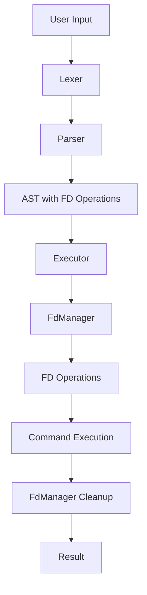

# File Descriptor Operations - Architecture Overview

## Executive Summary

This document outlines the architecture for adding comprehensive file descriptor (FD) operations support to the Rush shell. The implementation will introduce a new `FdManager` module to manage FD access and operations, enabling POSIX-compliant FD redirections and manipulations.

## Current State Analysis

### Existing Redirection Support

The Rush shell currently supports basic redirections:

- **Input redirection**: `< file` (stdin from file)
- **Output redirection**: `> file` (stdout to file)
- **Append redirection**: `>> file` (stdout append to file)
- **Here-document**: `<< DELIMITER` (stdin from inline content)
- **Here-string**: `<<< "content"` (stdin from string)

### Current Limitations

1. **No explicit FD operations**: Cannot specify FD numbers (e.g., `2>file`)
2. **No FD duplication**: Cannot duplicate FDs (e.g., `2>&1`)
3. **No FD closing**: Cannot close FDs (e.g., `2>&-`)
4. **No FD reading/writing**: Cannot read from/write to specific FDs (e.g., `>&3`, `<&4`)
5. **Limited lexer support**: Lexer partially recognizes FD syntax but doesn't fully parse it

## POSIX Requirements

### Required FD Operations (IEEE Std 1003.1-2008)

1. **FD Redirection**: `[n]>word` - Redirect FD n to file
2. **FD Duplication**: `[n]>&[m]` - Duplicate FD m to FD n
3. **FD Closing**: `[n]>&-` - Close FD n
4. **FD Reading**: `[n]<&[m]` - Duplicate FD m to FD n for reading
5. **FD Writing**: `[n]>&[m]` - Duplicate FD m to FD n for writing
6. **Here-document with FD**: `[n]<<[-]word` - Redirect FD n from here-document
7. **Here-string with FD**: `[n]<<<word` - Redirect FD n from here-string

### Standard File Descriptors

- **0**: stdin (standard input)
- **1**: stdout (standard output)
- **2**: stderr (standard error)

## Proposed Architecture

### Core Component: FdManager

The `FdManager` will be responsible for:

1. **FD Tracking**: Maintain a registry of open FDs and their states
2. **FD Operations**: Provide methods for FD duplication, closing, and redirection
3. **FD Validation**: Ensure FD operations are valid and safe
4. **FD Restoration**: Save and restore FD states for command execution
5. **FD Cleanup**: Properly close FDs after command execution

### Module Structure

```text
src/
├── fd_manager.rs          # New: Core FD management module
├── lexer.rs               # Modified: Enhanced FD tokenization
├── parser.rs              # Modified: FD operation AST nodes
├── executor.rs            # Modified: FD operation execution
└── state.rs               # Modified: FdManager integration
```

### Data Flow



## FdManager API Design

### Core Methods

```rust
pub struct FdManager {
    // Track original FD states for restoration
    saved_fds: HashMap<i32, SavedFdState>,
    // Track FD duplications
    fd_duplications: HashMap<i32, i32>,
}

impl FdManager {
    // Create new FdManager
    pub fn new() -> Self;
    
    // Duplicate FD: dup2(src_fd, dest_fd)
    pub fn duplicate_fd(&mut self, src_fd: i32, dest_fd: i32) -> Result<(), FdError>;
    
    // Close FD
    pub fn close_fd(&mut self, fd: i32) -> Result<(), FdError>;
    
    // Redirect FD to file
    pub fn redirect_to_file(&mut self, fd: i32, path: &str, append: bool) -> Result<(), FdError>;
    
    // Save current FD state
    pub fn save_fd(&mut self, fd: i32) -> Result<(), FdError>;
    
    // Restore saved FD state
    pub fn restore_fd(&mut self, fd: i32) -> Result<(), FdError>;
    
    // Restore all saved FDs
    pub fn restore_all(&mut self) -> Result<(), FdError>;
    
    // Check if FD is valid
    pub fn is_valid_fd(fd: i32) -> bool;
}
```

### Error Handling

```rust
pub enum FdError {
    InvalidFd(i32),
    FdClosed(i32),
    IoError(std::io::Error),
    PermissionDenied(String),
    FileNotFound(String),
}
```

## Integration Points

### 1. Lexer Enhancements

**Current**: Lexer partially recognizes FD syntax (lines 592-667 in lexer.rs)

**Enhancements**:

- Add new token types for FD operations
- Properly parse FD numbers before redirection operators
- Support FD duplication syntax (`>&`, `<&`)
- Support FD closing syntax (`>&-`, `<&-`)

**New Token Types**:

```rust
pub enum Token {
    // ... existing tokens ...
    RedirFdDup(i32, i32),      // [n]>&[m] - duplicate FD m to n
    RedirFdClose(i32),         // [n]>&- - close FD n
    RedirFdRead(i32, i32),     // [n]<&[m] - duplicate FD m to n for reading
    RedirFdWrite(i32, i32),    // [n]>&[m] - duplicate FD m to n for writing
}
```

### 2. Parser Enhancements

**Current**: ShellCommand struct has basic redirection fields

**Enhancements**:

- Add FD-specific redirection fields to ShellCommand
- Parse FD numbers from tokens
- Create AST nodes for FD operations

**Enhanced ShellCommand**:

```rust
pub struct ShellCommand {
    pub args: Vec<String>,
    pub input: Option<String>,
    pub output: Option<String>,
    pub append: Option<String>,
    pub here_doc_delimiter: Option<String>,
    pub here_doc_quoted: bool,
    pub here_string_content: Option<String>,
    // New FD-specific fields
    pub fd_redirections: Vec<FdRedirection>,
}

pub enum FdRedirection {
    RedirectToFile { fd: i32, path: String, append: bool },
    DuplicateFd { src_fd: i32, dest_fd: i32 },
    CloseFd { fd: i32 },
    HereDoc { fd: i32, delimiter: String, quoted: bool },
    HereString { fd: i32, content: String },
}
```

### 3. Executor Enhancements

**Current**: Executor handles basic redirections in execute_single_command and execute_pipeline

**Enhancements**:

- Integrate FdManager into command execution
- Apply FD redirections before command execution
- Restore FD states after command execution
- Handle FD operations in pipelines

**Execution Flow**:

```rust
fn execute_single_command(cmd: &ShellCommand, shell_state: &mut ShellState) -> i32 {
    // 1. Create FdManager
    let mut fd_manager = FdManager::new();
    
    // 2. Apply FD redirections
    for redir in &cmd.fd_redirections {
        fd_manager.apply_redirection(redir)?;
    }
    
    // 3. Execute command
    let exit_code = execute_command_with_fds(cmd, &fd_manager, shell_state);
    
    // 4. Restore FDs
    fd_manager.restore_all()?;
    
    exit_code
}
```

### 4. State Integration

**Current**: ShellState manages shell variables, functions, etc.

**Enhancements**:

- Add FdManager to ShellState for persistent FD tracking
- Provide access to FdManager for built-in commands
- Support FD operations in subshells and functions

## Implementation Phases

### Phase 1: Foundation (Core FdManager)

- Implement FdManager struct and core methods
- Add FD validation and error handling
- Create unit tests for FdManager

### Phase 2: Lexer Enhancements

- Add FD operation token types
- Implement FD number parsing
- Support FD duplication and closing syntax
- Add lexer tests for FD operations

### Phase 3: Parser Enhancements

- Add FdRedirection enum
- Extend ShellCommand with FD redirections
- Implement FD operation parsing
- Add parser tests for FD operations

### Phase 4: Executor Integration

- Integrate FdManager into command execution
- Apply FD redirections before execution
- Restore FD states after execution
- Handle FD operations in pipelines

### Phase 5: Testing and Validation

- Create comprehensive test suite
- Test POSIX compliance
- Test edge cases and error conditions
- Performance testing

### Phase 6: Documentation and Examples

- Update user documentation
- Create example scripts
- Add inline code documentation
- Update AGENTS.md

## Testing Strategy

### Unit Tests

- FdManager methods (duplicate, close, redirect, save, restore)
- FD validation and error handling
- Lexer tokenization of FD operations
- Parser parsing of FD operations

### Integration Tests

- Command execution with FD redirections
- Pipeline execution with FD operations
- Built-in command integration with FD operations
- Function and subshell FD handling

### Compliance Tests

- POSIX FD operation syntax
- Standard FD behavior (0, 1, 2)
- FD duplication semantics
- FD closing behavior

### Edge Cases

- Invalid FD numbers
- Closed FD operations
- Multiple FD redirections
- FD operations in pipelines
- FD operations in functions

## Performance Considerations

1. **FD State Tracking**: Minimize overhead of FD state management
2. **FD Restoration**: Efficient restoration of FD states
3. **Error Handling**: Fast path for common cases, detailed errors for failures
4. **Memory Usage**: Limit FD state storage to necessary information

## Security Considerations

1. **FD Validation**: Prevent operations on invalid or closed FDs
2. **Permission Checking**: Verify file permissions before FD operations
3. **Resource Cleanup**: Ensure FDs are properly closed to prevent leaks
4. **Error Handling**: Graceful degradation on FD operation failures

## Compatibility

### Backward Compatibility

- Existing redirection syntax remains unchanged
- New FD operations are additive, not breaking
- Default behavior (no FD specified) uses standard FDs

### POSIX Compliance

- Follow IEEE Std 1003.1-2008 specifications
- Match bash behavior for FD operations
- Support standard FD numbers (0, 1, 2) and custom FDs

## Success Criteria

1. **Functional**: All POSIX FD operations work correctly
2. **Compliant**: Meets POSIX specification requirements
3. **Tested**: Comprehensive test coverage (>90%)
4. **Documented**: Clear documentation and examples
5. **Performant**: No significant performance regression
6. **Safe**: Proper error handling and resource cleanup

## References

- IEEE Std 1003.1-2008 (POSIX Shell specification)
- Bash manual: Redirections section
- POSIX shell redirection semantics
- File descriptor management best practices
