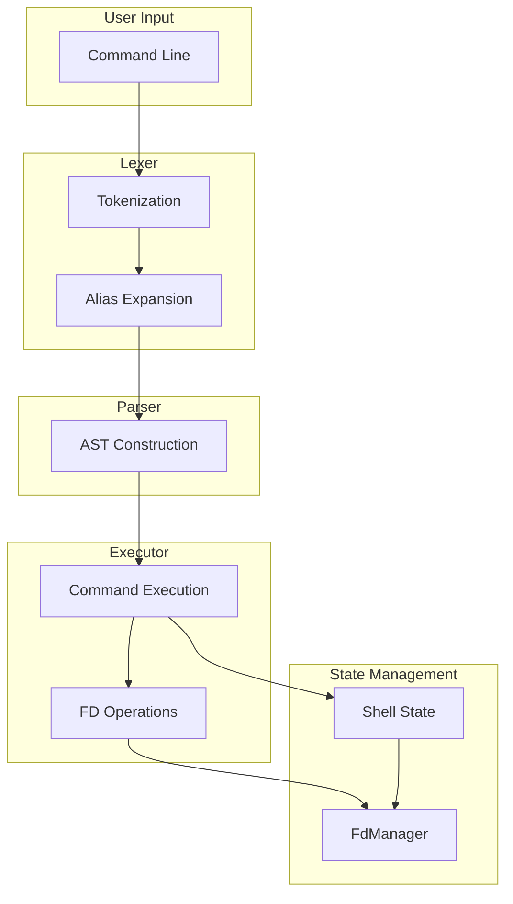
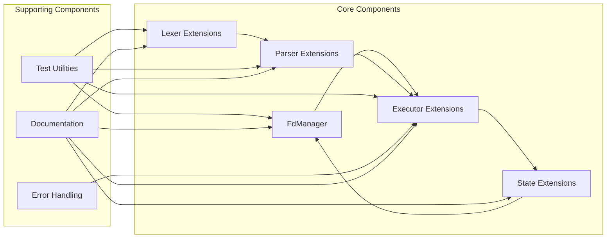
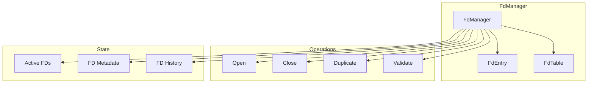

# File Descriptor Operations - Planning Documentation

## Overview

This directory contains comprehensive planning documentation for adding file descriptor (FD) operations support to the Rush shell. The goal is to achieve full POSIX compliance for FD operations while maintaining the project's goals of performance, reliability, and maintainability.

## Table of Contents

1. [Introduction](#introduction)
2. [Document Index](#document-index)
3. [Quick Start](#quick-start)
4. [Architecture Overview](#architecture-overview)
5. [Implementation Phases](#implementation-phases)
6. [Testing Strategy](#testing-strategy)
7. [POSIX Compliance](#posix-compliance)
8. [Next Steps](#next-steps)

## Introduction

File descriptor operations are a core feature of POSIX shells. They enable powerful I/O redirection, allowing users to control where input comes from and where output goes. The Rush shell currently has limited support for FD operations, and this planning documentation outlines a comprehensive approach to achieving full POSIX compliance.

### Current State

The Rush shell currently supports:

- Basic input/output redirections (`<`, `>`, `>>`)
- Simple FD specification (e.g., `2>file`)

### Target State

The Rush shell will support:

- All POSIX FD operations
- Here-documents and here-strings
- FD duplication and closure
- Complex redirection scenarios
- Comprehensive error handling
- Full POSIX compliance

## Document Index

| Document | Description | Status |
|----------|-------------|--------|
| [`01-introduction.md`](01-introduction.md) | Introduction to FD operations and project goals | ✅ Complete |
| [`02-requirements.md`](02-requirements.md) | Functional and non-functional requirements | ✅ Complete |
| [`03-architecture.md`](03-architecture.md) | System architecture and component design | ✅ Complete |
| [`04-fd-manager-design.md`](04-fd-manager-design.md) | FdManager component design and API | ✅ Complete |
| [`05-lexer-extensions.md`](05-lexer-extensions.md) | Lexer extensions for FD operation tokenization | ✅ Complete |
| [`06-parser-extensions.md`](06-parser-extensions.md) | Parser extensions for FD operation AST nodes | ✅ Complete |
| [`07-executor-integration.md`](07-executor-integration.md) | Executor integration for FD operations | ✅ Complete |
| [`08-state-management.md`](08-state-management.md) | State management integration for FD operations | ✅ Complete |
| [`09-posix-compliance.md`](09-posix-compliance.md) | POSIX compliance requirements and test cases | ✅ Complete |
| [`10-implementation-roadmap.md`](10-implementation-roadmap.md) | Phased implementation roadmap | ✅ Complete |

## Quick Start

### For Developers

1. **Start Here**: Read [`01-introduction.md`](01-introduction.md) for an overview
2. **Understand Requirements**: Review [`02-requirements.md`](02-requirements.md)
3. **Study Architecture**: Read [`03-architecture.md`](03-architecture.md)
4. **Review Components**: Study the component design documents:
   - [`04-fd-manager-design.md`](04-fd-manager-design.md)
   - [`05-lexer-extensions.md`](05-lexer-extensions.md)
   - [`06-parser-extensions.md`](06-parser-extensions.md)
   - [`07-executor-integration.md`](07-executor-integration.md)
   - [`08-state-management.md`](08-state-management.md)
5. **Check Compliance**: Review [`09-posix-compliance.md`](09-posix-compliance.md)
6. **Follow Roadmap**: Use [`10-implementation-roadmap.md`](10-implementation-roadmap.md) as a guide

### For Reviewers

1. **Review Architecture**: Read [`03-architecture.md`](03-architecture.md)
2. **Check Compliance**: Review [`09-posix-compliance.md`](09-posix-compliance.md)
3. **Evaluate Roadmap**: Review [`10-implementation-roadmap.md`](10-implementation-roadmap.md)
4. **Provide Feedback**: Provide feedback on the plan

## Architecture Overview

### System Architecture



### Component Architecture



### FdManager Architecture



## Implementation Phases

### Phase 0: Foundation and Preparation

**Duration**: 1-2 weeks

**Goals**:

- Establish the foundation for FD operations
- Set up testing infrastructure
- Create necessary documentation

**Deliverables**:

- FdManager module
- Test infrastructure
- Documentation

### Phase 1: Basic Redirections

**Duration**: 2-3 weeks

**Goals**:

- Implement basic input/output redirections
- Support FD specification
- Handle basic error conditions

**Deliverables**:

- Lexer extensions
- Parser extensions
- Executor extensions
- Tests

### Phase 2: Here-Documents and Here-Strings

**Duration**: 3-4 weeks

**Goals**:

- Implement here-document functionality
- Implement here-string functionality
- Support expansion in here-documents/here-strings

**Deliverables**:

- Lexer extensions
- Parser extensions
- Executor extensions
- Tests

### Phase 3: FD Duplication and Closure

**Duration**: 2-3 weeks

**Goals**:

- Implement FD duplication operations
- Implement FD closure operations
- Support FD specification

**Deliverables**:

- Lexer extensions
- Parser extensions
- Executor extensions
- Tests

### Phase 4: Complex Scenarios

**Duration**: 3-4 weeks

**Goals**:

- Implement multiple redirections per command
- Implement redirections in pipelines
- Implement redirections in subshells
- Implement redirections in command substitutions
- Implement redirections in functions

**Deliverables**:

- Executor extensions
- State management extensions
- Tests

### Phase 5: Error Handling and Robustness

**Duration**: 2-3 weeks

**Goals**:

- Implement comprehensive error handling
- Add diagnostic output
- Improve error messages
- Handle edge cases

**Deliverables**:

- Error handling
- Diagnostic output
- Tests

### Phase 6: POSIX Compliance and Testing

**Duration**: 2-3 weeks

**Goals**:

- Verify POSIX compliance
- Run comprehensive test suite
- Document any deviations
- Fix any compliance issues

**Deliverables**:

- POSIX compliance tests
- Comprehensive test suite
- Documentation

### Phase 7: Performance Optimization

**Duration**: 1-2 weeks

**Goals**:

- Optimize FD operations for performance
- Reduce memory usage
- Improve execution speed
- Benchmark and verify improvements

**Deliverables**:

- Performance optimizations
- Benchmarks
- Documentation

### Phase 8: Documentation and Examples

**Duration**: 1-2 weeks

**Goals**:

- Complete user documentation
- Complete developer documentation
- Create examples
- Create tutorials

**Deliverables**:

- User documentation
- Developer documentation
- Examples

## Testing Strategy

### Test Organization

```
tests/
├── fd/
│   ├── fd_manager_tests.rs      # FdManager unit tests
│   ├── lexer_tests.rs           # Lexer extension tests
│   ├── parser_tests.rs          # Parser extension tests
│   ├── executor_tests.rs        # Executor extension tests
│   ├── integration_tests.rs     # Integration tests
│   ├── posix_tests.rs           # POSIX compliance tests
│   └── performance_tests.rs     # Performance tests
└── fd_test_utils.rs             # Test utilities
```

### Test Coverage Goals

- **Unit Tests**: 90%+ coverage
- **Integration Tests**: All major scenarios
- **POSIX Tests**: All POSIX requirements
- **Performance Tests**: All FD operations

### Test Synchronization

**CRITICAL**: Tests that modify global state (environment variables, current directory, file descriptors, etc.) **MUST** use synchronization mutexes to prevent race conditions when running in parallel.

#### Available Test Mutexes

The test suite provides the following mutexes in `src/main.rs`:

```rust
// Mutex to serialize tests that change the current directory
static DIR_CHANGE_LOCK: Mutex<()> = Mutex::new(());

// Mutex to serialize tests that modify environment variables
static ENV_LOCK: Mutex<()> = Mutex::new(());

// Mutex to serialize tests that modify file descriptors
static FD_LOCK: Mutex<()> = Mutex::new(());
```

#### When to Use Test Mutexes

**You MUST use `FD_LOCK`** when your test:

- Opens or closes file descriptors
- Duplicates file descriptors
- Redirects file descriptors
- Modifies the FD table in any way

**You MUST use `ENV_LOCK`** when your test:

- Modifies environment variables
- Reads environment variables that other tests might modify

**You MUST use `DIR_CHANGE_LOCK`** when your test:

- Changes the current working directory
- Depends on the current working directory being in a specific location

#### Proper Test Structure with Mutexes

```rust
#[test]
fn test_fd_duplication() {
    // ALWAYS acquire the lock at the start of the test
    let _lock = FD_LOCK.lock().unwrap();
    
    // Save original FD state
    let original_fd = unsafe { libc::dup(1) };
    
    // Perform test operations
    let mut fd_manager = FdManager::new();
    fd_manager.duplicate_fd(1, 3).unwrap();
    
    // ... test logic here ...
    
    // ALWAYS restore original FD state
    unsafe {
        libc::dup2(original_fd, 1);
        libc::close(original_fd);
    }
    
    // Lock is automatically released when _lock goes out of scope
}
```

## POSIX Compliance

### POSIX Requirements

The POSIX specification (IEEE Std 1003.1-2008) defines the following requirements for FD operations:

1. **Redirection Operators**
   - `<` - Redirect input
   - `>` - Redirect output (truncate)
   - `>>` - Redirect output (append)
   - `<&` - Duplicate input FD
   - `>&` - Duplicate output FD
   - `<&-` - Close input FD
   - `>&-` - Close output FD

2. **Here-Documents**
   - `<<` - Here-document (unquoted)
   - `<<'DELIMITER'` - Here-document (quoted)
   - `<<-DELIMITER` - Here-document (tab stripping)

3. **Here-Strings**
   - `<<<` - Here-string

4. **FD Specification**
   - `[n]<word` - Redirect FD n from word
   - `[n]>word` - Redirect FD n to word
   - `[n]>>word` - Append to FD n from word
   - `[n]<&word` - Duplicate input FD n from word
   - `[n]>&word` - Duplicate output FD n to word
   - `[n]<&-` - Close FD n for input
   - `[n]>&-` - Close FD n for output

5. **Behavioral Requirements**
   - Redirections are evaluated left-to-right
   - Later redirections override earlier ones
   - FDs share file offset and status flags
   - Here-documents support expansion (unquoted)
   - Here-documents skip expansion (quoted)
   - Here-documents strip leading tabs (with `-`)

### Compliance Status

| Feature | Status | Notes |
|---------|--------|-------|
| Basic Redirections | Partial | `<`, `>`, `>>` supported, FD specification limited |
| Here-Documents | Not Implemented | Full support needed |
| Here-Strings | Not Implemented | Full support needed |
| FD Duplication | Not Implemented | Full support needed |
| FD Closure | Not Implemented | Full support needed |
| Complex Scenarios | Not Implemented | Full support needed |
| Error Handling | Partial | Basic error handling, needs improvement |

### Compliance Goals

- **Phase 1**: Basic redirections with full FD specification
- **Phase 2**: Here-documents and here-strings
- **Phase 3**: FD duplication and closure
- **Phase 4**: Complex scenarios
- **Phase 5**: Comprehensive error handling
- **Phase 6**: Full POSIX compliance verification

## Next Steps

### Immediate Actions

1. **Review Planning Documents**: Review all planning documents in this directory
2. **Approve Plan**: Approve the implementation roadmap
3. **Start Phase 0**: Begin with foundation and preparation

### Implementation Steps

1. **Phase 0**: Foundation and Preparation
   - Create FdManager module
   - Set up test infrastructure
   - Create documentation

2. **Phase 1**: Basic Redirections
   - Implement lexer extensions
   - Implement parser extensions
   - Implement executor extensions
   - Write tests

3. **Phase 2**: Here-Documents and Here-Strings
   - Implement lexer extensions
   - Implement parser extensions
   - Implement executor extensions
   - Write tests

4. **Phase 3**: FD Duplication and Closure
   - Implement lexer extensions
   - Implement parser extensions
   - Implement executor extensions
   - Write tests

5. **Phase 4**: Complex Scenarios
   - Implement executor extensions
   - Implement state management extensions
   - Write tests

6. **Phase 5**: Error Handling and Robustness
   - Implement error handling
   - Add diagnostic output
   - Write tests

7. **Phase 6**: POSIX Compliance and Testing
   - Run POSIX compliance tests
   - Fix any compliance issues
   - Document any deviations

8. **Phase 7**: Performance Optimization
   - Optimize FD operations
   - Benchmark improvements
   - Document optimizations

9. **Phase 8**: Documentation and Examples
   - Complete user documentation
   - Complete developer documentation
   - Create examples

### Success Criteria

- [ ] All POSIX FD operations are supported
- [ ] All FD operations work correctly
- [ ] All error conditions are handled
- [ ] All edge cases are handled
- [ ] Performance is acceptable
- [ ] Memory usage is reasonable
- [ ] Code is maintainable
- [ ] Documentation is complete
- [ ] All tests pass
- [ ] Test coverage is adequate
- [ ] Code follows project standards
- [ ] POSIX compliance is verified

## Summary

This planning documentation provides a comprehensive approach to adding file descriptor operations support to the Rush shell. By following the phased implementation roadmap, the project will achieve full POSIX compliance for FD operations while maintaining the project's goals of performance, reliability, and maintainability.

### Key Takeaways

1. **Comprehensive Planning**: All aspects of FD operations are planned
2. **Phased Approach**: Implementation is broken down into manageable phases
3. **Clear Architecture**: System architecture is well-defined
4. **Thorough Testing**: Comprehensive testing strategy is in place
5. **POSIX Compliance**: Full POSIX compliance is the goal

### Success Factors

1. **Clear Requirements**: POSIX compliance requirements are well-defined
2. **Incremental Implementation**: Each phase builds on the previous one
3. **Comprehensive Testing**: Thorough testing at each phase
4. **Clear Documentation**: Documentation is kept up to date
5. **Risk Management**: Risks are identified and mitigated early

By following this planning documentation, the Rush shell will achieve full POSIX compliance for file descriptor operations while maintaining the project's high standards for code quality, performance, and reliability.
