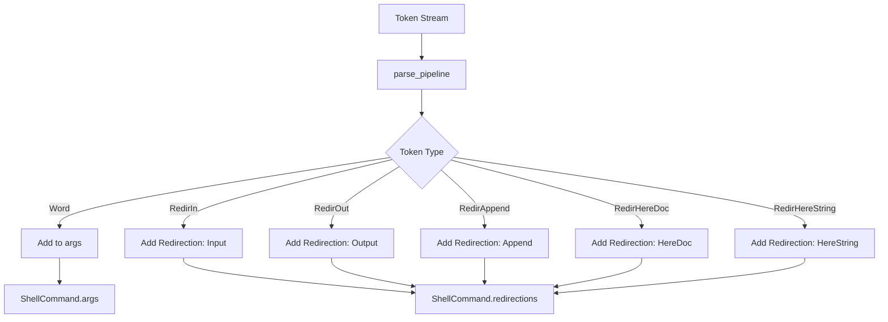

# Plan: Implement POSIX Redirection Structures

This plan outlines the changes required to support full POSIX file descriptor operations in `src/parser.rs`.

## Proposed Structures

### `RedirectionType` Enum
```rust
#[derive(Debug, Clone, PartialEq, Eq)]
pub enum RedirectionType {
    Input,              // [n]<word
    Output,             // [n]>word
    OutputForce,        // [n]>|word
    Append,             // [n]>>word
    ReadWrite,          // [n]<>word (Optional, but good for POSIX)
    DupInput,           // [n]<&word
    DupOutput,          // [n]>&word
    CloseInput,         // [n]<&-
    CloseOutput,        // [n]>&-
    HereDoc,            // [n]<<word
    HereDocStrip,       // [n]<<-word
    HereString,         // [n]<<<word
}
```

### `Redirection` Struct
```rust
#[derive(Debug, Clone, PartialEq, Eq)]
pub struct Redirection {
    pub n: i32, // Source file descriptor
    pub redir_type: RedirectionType,
    pub target: String, // word or target fd
    pub here_doc_quoted: bool,
}
```

### Updated `ShellCommand`
```rust
#[derive(Debug, Clone, PartialEq, Eq, Default)]
pub struct ShellCommand {
    pub args: Vec<String>,
    pub redirections: Vec<Redirection>,
}
```

## Implementation Steps

1.  **Update Lexer**:
    *   Modify `Token` enum in `src/lexer.rs` to include `Option<i32>` for all redirection tokens.
    *   Update `lex` function in `src/lexer.rs` to detect leading digits before redirection operators and store them in the token.
2.  **Define Enums and Structs in Parser**: Add `RedirectionType` and `Redirection` to `src/parser.rs`.
3.  **Update `ShellCommand`**: Replace individual redirection fields with `Vec<Redirection>`.
4.  **Update Helper Functions**: Update `create_empty_body_ast` to use the new `ShellCommand` structure.
5.  **Update `parse_pipeline`**:
    *   Modify the loop to handle the updated `Token::Redir*` variants.
    *   Create `Redirection` instances using the FD from the token (or default if `None`).
6.  **Update Tests**: Fix all broken tests in `src/parser.rs` and `src/lexer.rs` to accommodate the new token and command structures.

## Mermaid Diagram


