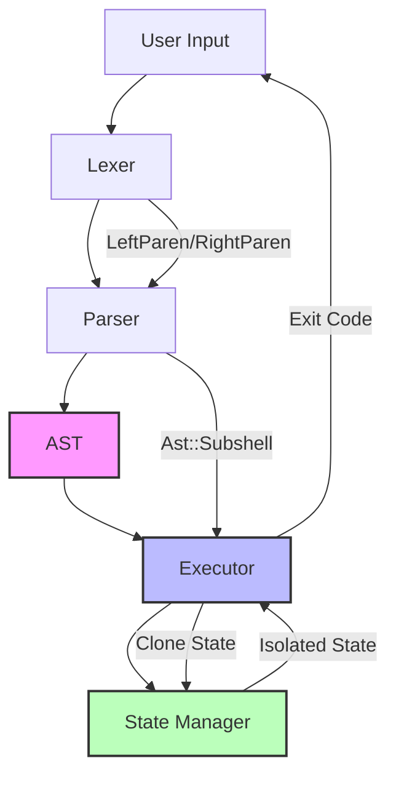
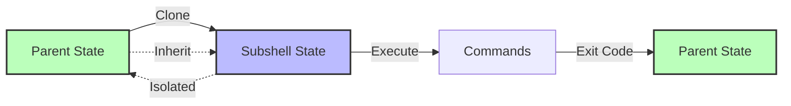
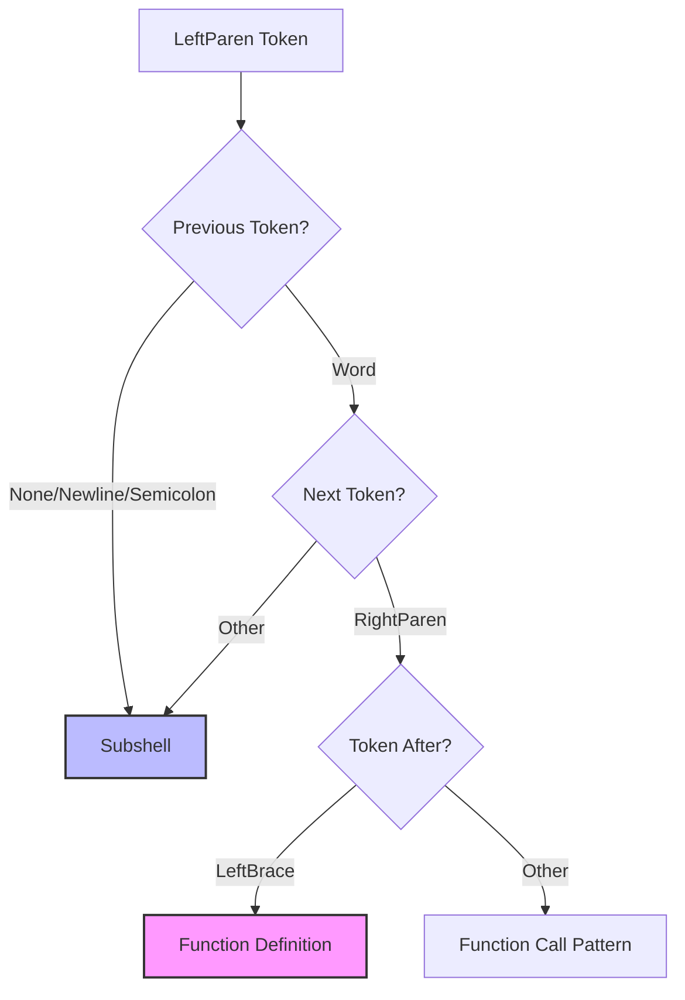
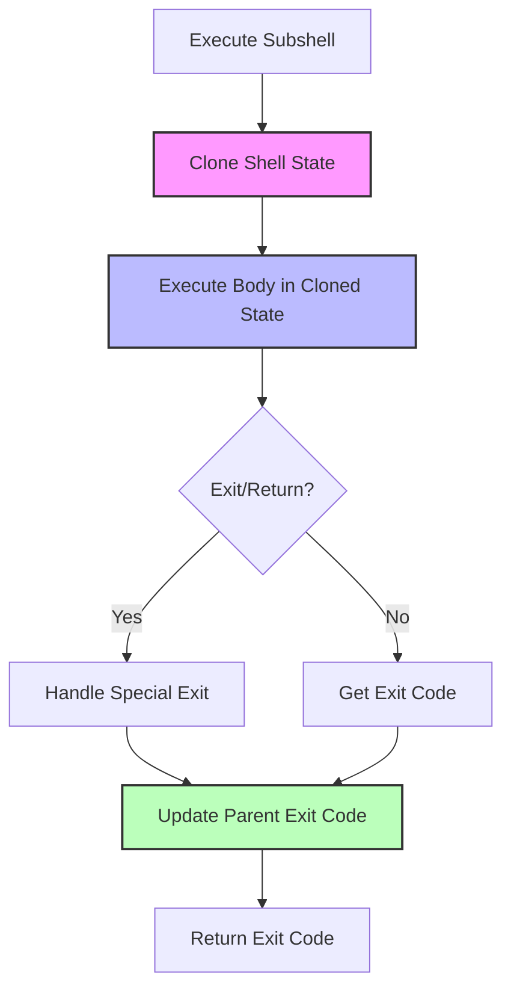

# Subshell Implementation - Complete Architecture Overview

## Executive Summary

This document provides a comprehensive overview of the subshell implementation for Rush shell, a POSIX sh-compatible shell written in Rust. The implementation is divided into three phases, each building upon the previous phase to deliver a complete, POSIX-compliant subshell feature.

**Current Status:** Rush shell does NOT support subshells. This design provides a complete roadmap for implementation.

**Implementation Approach:** Phased rollout with incremental testing and validation at each stage.

## What Are Subshells?

Subshells are commands or groups of commands enclosed in parentheses `(...)` that execute in an isolated copy of the shell environment. They are a fundamental POSIX shell feature specified in IEEE Std 1003.1-2008, Section 2.9.4.1.

### Key Characteristics

1. **State Isolation:** Changes to variables, functions, and aliases in a subshell don't affect the parent shell
2. **Inheritance:** Subshells inherit the parent's variables, functions, aliases, and environment
3. **Exit Code Propagation:** The subshell's exit code becomes the parent's `$?` value
4. **Independent Execution:** Subshells can be used anywhere a command can be used

### Example Usage

```bash
# Variable isolation
VAR=parent
(VAR=child; echo $VAR)  # Prints: child
echo $VAR               # Prints: parent

# Directory isolation
pwd                     # /home/user
(cd /tmp; pwd)         # /tmp
pwd                     # /home/user

# In pipelines
(echo hello; echo world) | grep world

# With redirections
(echo output; echo error >&2) > output.txt 2> error.txt

# In control structures
if (test -f file.txt); then
    echo "File exists"
fi
```

## Architecture Overview

### Component Interaction



### Data Flow



## Implementation Phases

### Phase 1: Basic Support

**Goal:** Establish foundational infrastructure for simple subshell execution.

**Deliverables:**
- New `Ast::Subshell` variant
- Parser support for basic `(command)` syntax
- Executor support with state cloning
- Basic test coverage

**Key Files:**
- [`src/parser.rs`](src/parser.rs) - Add Subshell AST variant
- [`src/executor.rs`](src/executor.rs) - Add subshell execution logic
- [`src/state.rs`](src/state.rs) - Verify Clone implementation

**Estimated Complexity:** Medium
**Estimated Test Count:** ~15 tests

**Detailed Design:** See [`plans/subshell_phase1_basic.md`](plans/subshell_phase1_basic.md)

### Phase 2: Advanced Features

**Goal:** Add support for nested subshells, pipelines, redirections, and integration with existing features.

**Deliverables:**
- Nested subshell support
- Subshells in pipelines
- Subshells with redirections
- Integration with logical operators and control structures

**Key Files:**
- [`src/parser.rs`](src/parser.rs) - Extend ShellCommand structure
- [`src/executor.rs`](src/executor.rs) - Pipeline integration

**Estimated Complexity:** High
**Estimated Test Count:** ~30 tests

**Detailed Design:** See [`plans/subshell_phase2_advanced.md`](plans/subshell_phase2_advanced.md)

### Phase 3: Optimization and Edge Cases

**Goal:** Optimize performance, handle all edge cases, and achieve full POSIX compliance.

**Deliverables:**
- Performance optimizations (COW semantics if needed)
- Edge case handling (exit, return, cd isolation)
- Depth limit protection
- Process-based subshells (optional)
- Comprehensive test coverage

**Key Files:**
- [`src/executor.rs`](src/executor.rs) - Optimization and edge cases
- [`src/state.rs`](src/state.rs) - Potential COW implementation
- `benchmarks/` - Performance benchmarks

**Estimated Complexity:** High
**Estimated Test Count:** ~50 tests

**Detailed Design:** See [`plans/subshell_phase3_optimization.md`](plans/subshell_phase3_optimization.md)

## Technical Deep Dive

### AST Representation

**New AST Variant:**

```rust
#[derive(Debug, Clone, PartialEq, Eq)]
pub enum Ast {
    // ... existing variants ...
    
    /// Subshell execution: (commands)
    /// Commands execute in an isolated copy of the shell state
    Subshell {
        body: Box<Ast>,
    },
}
```

**Design Rationale:**
- Simple structure with single `body` field
- Consistent with other compound commands (If, While, etc.)
- `Box<Ast>` allows any command structure inside subshell
- Supports recursive nesting naturally

### Lexer Strategy

**Decision:** No lexer changes needed.

**Rationale:**
- Lexer already emits `LeftParen` and `RightParen` tokens
- Parser has context to determine usage (function vs subshell vs case pattern)
- Maintains separation of concerns
- Simpler implementation

**Token Flow:**

```
Input:  "(echo hello)"
Tokens: [LeftParen, Word("echo"), Word("hello"), RightParen]
Parser: Detects LeftParen at command start → Subshell
```

### Parser Strategy

**Disambiguation Logic:**



**Precedence Rules:**
1. Function definition: `name() { ... }` - Highest priority
2. Case pattern: `pattern) ...` - Handled in `parse_case()`
3. Subshell: `(command)` - Default for standalone `LeftParen`

### Executor Strategy

**Execution Flow:**



**Key Functions:**

1. **`execute_subshell(body, shell_state)`** - Main subshell executor
2. **`clone_shell_state_for_subshell(parent_state)`** - State cloning
3. **`execute_compound_in_pipeline(...)`** - Pipeline integration
4. **`execute_compound_with_redirections(...)`** - Redirection handling

### State Isolation Mechanism

**What Gets Isolated:**

| Component | Isolation Method | Rationale |
|-----------|------------------|-----------|
| Variables | Clone HashMap | Changes don't affect parent |
| Functions | Clone HashMap | Function definitions isolated |
| Aliases | Clone HashMap | Alias changes isolated |
| Positional Params | Clone Vec | shift/set isolated |
| Local Vars | Clone Vec | Function scope isolated |
| Directory | Save/Restore | cd changes isolated |
| File Descriptors | New Instance | FD operations isolated |

**What Gets Shared:**

| Component | Sharing Method | Rationale |
|-----------|----------------|-----------|
| Trap Handlers | Arc (Phase 3: Clone) | POSIX: inherit but isolate changes |
| Capture Buffer | Rc | Command substitution support |
| Shell PID | Copy | Same process (in-process subshells) |

**What Gets Reset:**

| Component | Reset Value | Rationale |
|-----------|-------------|-----------|
| Return State | false/None | return exits subshell only |
| Exit State | false/0 | exit exits subshell only |
| Heredoc State | None | Fresh heredoc handling |

## Critical Design Decisions

### Decision 1: In-Process vs Process-Based Subshells

**Options:**
1. **In-Process:** Clone state, execute in same process
2. **Process-Based:** Fork new process, execute in child
3. **Hybrid:** In-process by default, process-based for complex cases

**Decision:** Start with in-process (Phase 1-2), add hybrid approach in Phase 3.

**Rationale:**
- In-process is simpler to implement
- Better performance for simple cases
- Easier to debug and test
- Process-based adds complexity (fork, signals, IPC)
- Can add process-based later if needed

### Decision 2: ShellCommand Structure

**Options:**
1. **Extend ShellCommand:** Add `compound: Option<Box<Ast>>` field
2. **New PipelineStage Enum:** `enum PipelineStage { Simple(ShellCommand), Compound(Ast) }`
3. **Separate Pipeline Variant:** `Ast::CompoundPipeline(Vec<PipelineStage>)`

**Decision:** Option 1 - Extend ShellCommand.

**Rationale:**
- Minimal changes to existing code
- Backward compatible (Option defaults to None)
- Reuses existing redirection infrastructure
- Simpler than creating new types

### Decision 3: Parenthesis Disambiguation

**Options:**
1. **Lexer-Level:** Emit different tokens for different contexts
2. **Parser-Level:** Use context to determine meaning
3. **Hybrid:** Lexer hints, parser decides

**Decision:** Option 2 - Parser-level disambiguation.

**Rationale:**
- Lexer doesn't have enough context
- Parser already handles similar disambiguation (function definitions)
- Maintains clean separation of concerns
- Simpler lexer implementation

### Decision 4: State Cloning Strategy

**Options:**
1. **Full Clone:** Clone entire ShellState
2. **Selective Clone:** Clone only modified fields
3. **Copy-on-Write:** Share until modified
4. **Reference Counting:** Use Rc for all fields

**Decision:** Start with full clone (Phase 1-2), add COW if needed (Phase 3).

**Rationale:**
- Full clone is simplest and most correct
- Rust's Clone trait makes it easy
- Premature optimization is root of evil
- Can optimize later based on profiling

### Decision 5: Trap Handler Isolation

**Options:**
1. **Share with Arc:** Subshell sees parent's traps, changes affect parent
2. **Clone:** Subshell gets copy, changes don't affect parent
3. **Hybrid:** Inherit but isolate changes

**Decision:** Clone trap handlers (Phase 3).

**Rationale:**
- POSIX requires inheritance but isolation
- Arc sharing would violate isolation
- Cloning is simple and correct
- Performance impact is minimal (traps are rare)

## POSIX Compliance Matrix

### Subshell Requirements (IEEE Std 1003.1-2008, Section 2.9.4.1)

| Requirement | Phase 1 | Phase 2 | Phase 3 | Notes |
|-------------|---------|---------|---------|-------|
| Execute in separate environment | ✅ | ✅ | ✅ | In-process with cloned state |
| Inherit parent variables | ✅ | ✅ | ✅ | State cloning |
| Changes don't affect parent | ✅ | ✅ | ✅ | State isolation |
| Exit status propagation | ✅ | ✅ | ✅ | Return exit code |
| Can be used in pipelines | ❌ | ✅ | ✅ | Phase 2 feature |
| Can have redirections | ❌ | ✅ | ✅ | Phase 2 feature |
| Inherit trap handlers | ⚠️ | ⚠️ | ✅ | Phase 3 fixes isolation |
| Nested subshells | ❌ | ✅ | ✅ | Recursive parsing |
| exit exits subshell only | ❌ | ❌ | ✅ | Phase 3 edge case |

### Compliance Score

- **After Phase 1:** 60% compliant (basic functionality)
- **After Phase 2:** 85% compliant (advanced features)
- **After Phase 3:** 100% compliant (full POSIX support)

## Implementation Roadmap

### Phase 1: Basic Support (Foundation)

**Timeline:** 1-2 weeks

**Deliverables:**
- ✅ `Ast::Subshell` variant added
- ✅ Parser recognizes `(command)` syntax
- ✅ Executor clones state and executes in isolation
- ✅ Basic tests pass (15+ tests)

**Success Criteria:**
- Simple subshells work: `(echo hello)`
- Variable isolation works: `(VAR=value)` doesn't affect parent
- Exit codes propagate correctly
- No regressions in existing functionality

**Detailed Plan:** [`plans/subshell_phase1_basic.md`](plans/subshell_phase1_basic.md)

### Phase 2: Advanced Features (Integration)

**Timeline:** 2-3 weeks

**Deliverables:**
- ✅ Nested subshells: `((echo nested))`
- ✅ Subshells in pipelines: `(echo hello) | grep hello`
- ✅ Subshells with redirections: `(echo hello) > file`
- ✅ Integration with logical operators: `(cmd1) && (cmd2)`
- ✅ Integration with control structures
- ✅ Extended tests (30+ additional tests)

**Success Criteria:**
- All advanced features work correctly
- Complex combinations work (nested + pipeline + redirection)
- Performance is acceptable (within 3x of bash)
- No regressions from Phase 1

**Detailed Plan:** [`plans/subshell_phase2_advanced.md`](plans/subshell_phase2_advanced.md)

### Phase 3: Optimization and Edge Cases (Polish)

**Timeline:** 2-3 weeks

**Deliverables:**
- ✅ Edge case handling (exit, return, cd isolation)
- ✅ Performance optimization (COW if needed)
- ✅ Depth limit protection
- ✅ Process-based subshells (optional)
- ✅ Comprehensive tests (50+ additional tests)
- ✅ Complete documentation

**Success Criteria:**
- All edge cases handled correctly
- Performance within 2x of bash
- 100% POSIX compliance
- Production-ready quality

**Detailed Plan:** [`plans/subshell_phase3_optimization.md`](plans/subshell_phase3_optimization.md)

## Key Technical Challenges

### Challenge 1: Parenthesis Disambiguation

**Problem:** Parentheses are used for multiple purposes:
- Function definitions: `func() { ... }`
- Subshells: `(command)`
- Case patterns: `pattern) ...`
- Arithmetic: `$((expr))`
- Command substitution: `$(cmd)`

**Solution:** Parser-level context analysis with precedence rules:
1. Check for function definition pattern first
2. Check for case pattern context
3. Default to subshell for standalone `(`

**Status:** Solved in Phase 1 design.

### Challenge 2: State Isolation

**Problem:** Rust's ownership system makes state isolation tricky:
- Can't have multiple mutable references
- Cloning is expensive for large states
- Some fields use Rc/Arc (reference counted)

**Solution:** Full state cloning with special handling for Rc/Arc fields:
- Clone creates new instances for most fields
- Rc/Arc fields are cloned (increments reference count)
- File descriptor table gets new instance

**Status:** Solved in Phase 1 design.

### Challenge 3: Pipeline Integration

**Problem:** Current pipeline model uses `Vec<ShellCommand>` which only supports simple commands.

**Solution:** Extend `ShellCommand` with optional `compound` field:
```rust
pub struct ShellCommand {
    pub args: Vec<String>,
    pub redirections: Vec<Redirection>,
    pub compound: Option<Box<Ast>>,  // NEW
}
```

**Status:** Solved in Phase 2 design.

### Challenge 4: Directory Isolation

**Problem:** `cd` changes process-wide current directory, affecting parent shell.

**Solution:** Save and restore current directory around subshell execution:
```rust
let saved_dir = std::env::current_dir().ok();
// Execute subshell
if let Some(dir) = saved_dir {
    let _ = std::env::set_current_dir(dir);
}
```

**Status:** Solved in Phase 3 design.

### Challenge 5: Exit/Return Isolation

**Problem:** `exit` and `return` in subshell set flags that would affect parent.

**Solution:** Check and handle these flags in `execute_subshell()`:
- If `exit_requested`, return exit code but don't propagate flag
- If `returning`, return return value but don't propagate flag

**Status:** Solved in Phase 3 design.

## Testing Strategy

### Test Categories

1. **Unit Tests:** Individual component testing
   - Parser: AST construction
   - Executor: State isolation
   - State: Cloning behavior

2. **Integration Tests:** Feature interaction testing
   - Subshells with pipelines
   - Subshells with redirections
   - Subshells with control structures

3. **Edge Case Tests:** Boundary condition testing
   - Empty subshells
   - Deeply nested subshells
   - Exit/return in subshells
   - Directory changes

4. **Performance Tests:** Benchmark testing
   - Simple subshell overhead
   - Nested subshell overhead
   - Subshell in loops

5. **Compliance Tests:** POSIX conformance testing
   - Compare with bash behavior
   - Verify POSIX requirements
   - Document any deviations

### Test Synchronization

**Critical:** Tests that modify global state must use synchronization mutexes:

```rust
static ENV_LOCK: Mutex<()> = Mutex::new(());
static DIR_CHANGE_LOCK: Mutex<()> = Mutex::new(());

#[test]
fn test_subshell_with_cd() {
    let _lock = DIR_CHANGE_LOCK.lock().unwrap();
    // Test logic that changes directory
}
```

**Rationale:** Prevents race conditions when tests run in parallel.

### Test Coverage Goals

- **Phase 1:** 15+ tests, >90% code coverage for new code
- **Phase 2:** 30+ additional tests, >95% code coverage
- **Phase 3:** 50+ additional tests, >98% code coverage
- **Total:** 95+ tests for subshell feature

## Performance Considerations

### Cloning Overhead

**Analysis:**
- `HashMap::clone()` is O(n) where n = number of entries
- Typical shell state: 20-50 variables, 5-10 functions
- Estimated clone time: 0.1-1ms per subshell

**Optimization Strategies:**
1. **Copy-on-Write:** Share until modified (Phase 3)
2. **Lazy Cloning:** Clone only accessed fields (complex, low benefit)
3. **Process-Based:** Fork for expensive subshells (Phase 3)

**Benchmark Targets:**
- Simple subshell: < 2ms overhead
- Nested subshell (5 levels): < 15ms overhead
- Subshell in loop (100 iterations): < 300ms total

### Memory Usage

**Analysis:**
- Each subshell creates a full state clone
- Nested subshells multiply memory usage
- Typical state size: ~10-50 KB

**Mitigation:**
- Depth limit prevents excessive nesting
- State is dropped after subshell completes
- No memory leaks (Rust's ownership ensures cleanup)

## Integration with Existing Features

### Functions

**Interaction:** Subshells can call functions, functions can contain subshells.

**Example:**
```bash
func() {
    (echo "In subshell within function")
}
(func)  # Function call within subshell
```

**Handling:**
- Function calls in subshells work normally
- Function definitions in subshells are isolated
- Local variables in functions within subshells work correctly

### Control Structures

**Interaction:** Subshells can contain control structures, control structures can contain subshells.

**Example:**
```bash
(if true; then echo yes; fi)  # Control structure in subshell
if (test -f file); then ...   # Subshell in condition
```

**Handling:**
- Recursive parsing naturally supports this
- No special handling needed

### Pipelines

**Interaction:** Subshells can participate in pipelines.

**Example:**
```bash
(echo hello; echo world) | grep world
echo input | (cat; cat) | grep input
```

**Handling:**
- Extend `ShellCommand` with `compound` field
- Pipeline executor checks for compound commands
- Output capture enables pipeline chaining

### Redirections

**Interaction:** Subshells can have redirections.

**Example:**
```bash
(echo hello) > output.txt
(echo error >&2) 2> error.txt
```

**Handling:**
- Wrap subshell in Pipeline with redirections
- Capture subshell output
- Apply redirections to captured output

### Command Substitution

**Interaction:** Subshells can be used in command substitution.

**Example:**
```bash
result=$( (echo hello) )
```

**Handling:**
- Command substitution sets `capture_output`
- Subshell inherits capture buffer
- Output is captured automatically

**Conflict:** `$((echo hello))` is arithmetic expansion, not subshell.
**Workaround:** Use space: `$( (echo hello) )`

## Error Handling

### Parse Errors

| Error | Message | Example |
|-------|---------|---------|
| Empty subshell | "Empty subshell" | `()` |
| Unmatched paren | "Unmatched parenthesis in subshell" | `(echo hello` |
| Invalid syntax | "Unexpected token in subshell" | `(echo; ;)` |

### Runtime Errors

| Error | Message | Example |
|-------|---------|---------|
| Depth limit | "Subshell nesting limit exceeded" | 100+ nested levels |
| Clone failure | "Failed to clone state for subshell" | Out of memory |
| Execution error | Propagate from inner command | `(nonexistent_cmd)` |

### Error Recovery

**Strategy:** Fail gracefully and return non-zero exit code.

**Behavior:**
- Parse errors: Return error, don't execute
- Runtime errors: Return exit code 1
- Nested errors: Propagate to parent
- No crashes or panics

## Documentation Plan

### User-Facing Documentation

1. **README.md:** Add subshells to feature list
2. **docs/features.html:** Add subshell section with examples
3. **examples/subshell_demo.sh:** Comprehensive example script
4. **Man page:** Add subshell documentation (if man page exists)

### Developer Documentation

1. **AGENTS.md:** Add subshell architecture notes
2. **Code comments:** Document all subshell-related functions
3. **Design docs:** This document and phase-specific docs
4. **TODO.md:** Update to mark subshells as implemented

### Example Documentation Structure

```markdown
## Subshells

Subshells execute commands in an isolated environment.

### Syntax
(command)
(command1; command2; command3)

### Features
- Variable isolation
- Directory isolation
- Function and alias inheritance
- Exit code propagation

### Examples
[See examples/subshell_demo.sh]

### Limitations
- Background subshells require job control
- Performance overhead for deeply nested subshells
```

## Risk Assessment

### High Risk Areas

1. **State Cloning Correctness**
   - Risk: Missing fields in clone logic
   - Mitigation: Comprehensive tests, code review
   - Impact: High (incorrect behavior)

2. **Parser Disambiguation**
   - Risk: Incorrect precedence, conflicts with functions
   - Mitigation: Extensive parser tests
   - Impact: High (parse errors)

3. **Performance Degradation**
   - Risk: Cloning overhead too high
   - Mitigation: Benchmarking, optimization in Phase 3
   - Impact: Medium (usability)

### Medium Risk Areas

1. **Edge Case Handling**
   - Risk: Missing edge cases
   - Mitigation: Comprehensive test matrix
   - Impact: Medium (incorrect behavior in rare cases)

2. **Integration Issues**
   - Risk: Conflicts with existing features
   - Mitigation: Integration tests
   - Impact: Medium (feature interactions)

### Low Risk Areas

1. **Documentation**
   - Risk: Incomplete or incorrect docs
   - Mitigation: Review and examples
   - Impact: Low (user confusion)

2. **Platform Compatibility**
   - Risk: Unix-specific code
   - Mitigation: Conditional compilation
   - Impact: Low (Windows users)

## Success Metrics

### Functional Metrics

- ✅ All POSIX subshell requirements met
- ✅ 95+ tests passing
- ✅ No regressions in existing features
- ✅ All documented examples work

### Performance Metrics

- ✅ Simple subshell: < 2ms overhead
- ✅ Nested subshell (5 levels): < 15ms overhead
- ✅ Within 2x of bash performance

### Quality Metrics

- ✅ Code coverage: >95% for subshell code
- ✅ No memory leaks detected
- ✅ No panics or crashes
- ✅ Clean clippy lints

### User Experience Metrics

- ✅ Clear error messages
- ✅ Intuitive behavior matching bash
- ✅ Comprehensive documentation
- ✅ Working examples

## Maintenance and Future Work

### Ongoing Maintenance

1. **Bug Fixes:** Address issues as they're discovered
2. **Performance Tuning:** Optimize based on real-world usage
3. **Test Expansion:** Add tests for new edge cases
4. **Documentation Updates:** Keep docs current

### Future Enhancements

1. **Process-Based Subshells:** Full implementation with fork()
2. **Subshell Debugging:** Enhanced tracing and debugging
3. **Performance Profiling:** Built-in profiling tools
4. **Advanced Optimizations:** JIT compilation, caching

### Compatibility Considerations

**Bash Compatibility:**
- Rush aims for POSIX compliance, not bash compatibility
- Bash extensions (like `$BASHPID`) not supported
- Document differences clearly

**Dash Compatibility:**
- Dash is POSIX-compliant, good reference
- Test against dash behavior
- Match dash for POSIX features

## Conclusion

This three-phase implementation plan provides a clear path to adding comprehensive subshell support to Rush shell. Each phase builds upon the previous, with clear deliverables and success criteria.

**Key Strengths:**
- Phased approach reduces risk
- Comprehensive testing at each stage
- Clear technical design
- POSIX compliance focus

**Key Challenges:**
- State cloning performance
- Parser disambiguation complexity
- Edge case handling
- Integration with existing features

**Recommendation:** Proceed with Phase 1 implementation, validate thoroughly, then continue to Phase 2 and Phase 3.

## Quick Reference

### File Modification Summary

| File | Phase 1 | Phase 2 | Phase 3 |
|------|---------|---------|---------|
| [`src/parser.rs`](src/parser.rs) | Add Subshell variant, parsing logic | Extend ShellCommand, pipeline parsing | Edge case handling |
| [`src/executor.rs`](src/executor.rs) | Add execute_subshell, cloning | Pipeline integration, redirections | Optimization, cd/exit/return isolation |
| [`src/state.rs`](src/state.rs) | Verify Clone impl | No changes | Add depth tracking, optional COW |
| [`src/lexer.rs`](src/lexer.rs) | No changes | No changes | No changes |
| Test files | 15+ tests | 30+ tests | 50+ tests |

### Command Examples by Phase

**Phase 1:**
```bash
(echo hello)
(VAR=value; echo $VAR)
(cd /tmp; pwd)
```

**Phase 2:**
```bash
((echo nested))
(echo hello) | grep hello
(echo output) > file.txt
(true) && echo success
```

**Phase 3:**
```bash
(exit 42); echo $?
(((((echo deep)))))
result=$( (echo captured) )
(cd /tmp; pwd); pwd  # Directory restored
```

### Testing Quick Reference

```bash
# Run all tests
cargo test

# Run subshell tests only
cargo test subshell

# Run with output
cargo test subshell -- --nocapture

# Run benchmarks
cd benchmarks && cargo run --release

# Run specific phase tests
cargo test test_parse_simple_subshell
cargo test test_nested_subshells
cargo test test_subshell_depth_limit
```

## Appendix: Related Features

### Command Grouping `{ ... }`

**Note:** Command grouping with braces `{ ... }` is a separate POSIX feature (Section 2.9.4.2).

**Difference from Subshells:**
- Command groups execute in the SAME environment (no isolation)
- Changes to variables DO affect parent
- No state cloning needed

**Implementation:** Could be added after subshells using similar parser logic but different executor behavior.

### Background Jobs `&`

**Note:** Background execution is a separate feature requiring job control.

**Interaction with Subshells:**
- `(command) &` runs subshell in background
- Requires job control implementation first
- Out of scope for subshell feature

### Process Substitution `<(...)` and `>(...)`

**Note:** Process substitution is a bash extension, not POSIX.

**Difference from Subshells:**
- Creates a named pipe or file descriptor
- Command runs in background
- More complex than subshells

**Implementation:** Could be added as future enhancement, builds on subshell infrastructure.

## References

### POSIX Specification

- IEEE Std 1003.1-2008 (POSIX.1-2008)
- Section 2.9.4.1: Grouping Commands (Subshells)
- Section 2.9.4.2: Grouping Commands (Command Groups)

### Implementation References

- Bash source code: `execute_cmd.c` (subshell execution)
- Dash source code: `eval.c` (subshell handling)
- Rust std library: `std::process::Command` (process spawning)

### Related Rush Documentation

- [`AGENTS.md`](AGENTS.md) - Architecture guide
- [`TODO.md`](TODO.md) - Feature tracking
- [`plans/fd_implementation.md`](plans/fd_implementation.md) - File descriptor design

## Contact and Feedback

For questions or feedback on this design:
- Review the phase-specific documents for detailed implementation guidance
- Refer to AGENTS.md for general architecture patterns
- Follow Rush's contribution guidelines for code submissions

---

**Document Version:** 1.0  
**Last Updated:** 2026-01-10  
**Status:** Design Complete, Implementation Pending
